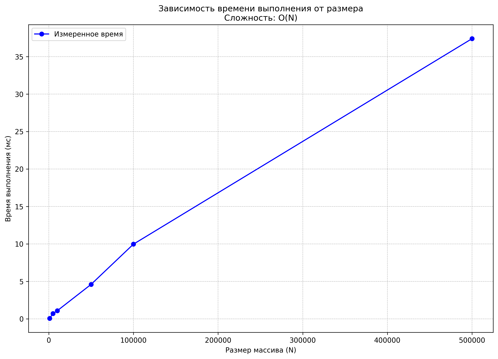

# **Тема00**: Решение алгоритмических задач. Введение в инструменты и критерии
## Студента группы ПИЖ-б-о-23-2(2) Орлова Владимира Алексеевича
### Репозиторий Git: https://github.com/Z1RKON/OrlovVA    

*Задание: написать программу, которая:*
1. Считывает два целых числа, a и b, из стандартного потока ввода.
2. Вычисляет их сумму.
3. Выводит результат в стандартный поток вывода.

## Написание и анализ кода

- Реализовать чтение чисел из файла (с кратким выводом в консоль содержимого файла с пояснением).
- Реализовать вычисление суммы.
- Реализовать вывод результата.
- После каждой строки кода в комментарии указать её асимптотическую сложность.
- В конце функции в комментарии указать общу сложность алгоритма.  

## Теоретическая оценка:
Ожидаемая сложность алгоритма суммирования массива — O(N).

## Пример вывода программы

Характеристики ПК для тестирования:       
  - Процессор: Intel Core i7-6500U @ 2.50GHz
  - Оперативная память: 8 GB
  - ОС: Windows 10 PRO
  - Python: 3.12.8

=== Задание 1: Сумма двух чисел ===
Введите два целых числа:
2
3
Сумма чисел: 5

=== Задание 2: Чтение из файла ===
Содержимое файла input.txt:
10 20 30 40 50
Сумма первых двух чисел: 30

=== Задание 3: Анализ производительности ===
Замеры времени выполнения для алгоритма суммирования массива:
---------------------------------------------
Размер (N) |   Время (мс) |   Время/N (мкс)

  1000          0.0814           0.0814
  5000          0.4798           0.0960
 10000          1.2379           0.1238
 50000          4.4697           0.0894
100000          4.8207           0.0482
500000         30.9967           0.0620

## График зависимости времени выполнения от размера массива

График сохранен в файл 'time_complexity_plot.png'

=== Анализ результатов ===
1. Теоретическая сложность алгоритма: O(N)
2. Практические замеры показывают линейную зависимость T от N
3. Среднее время на один элемент: 0.0960 мкс
4. Программа корректно обрабатывает большие объемы данных:
   - Максимальный тестируемый размер: 500,000 элементов
   - Время выполнения: 29.21 мс
   - Потребление памяти: линейное O(N)