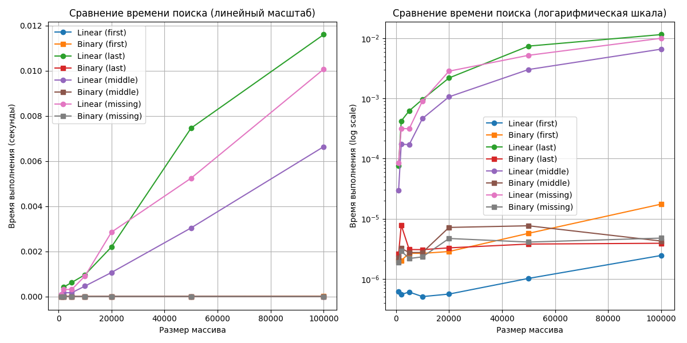

# Лабораторная работа 01 - Сравнение алгоритмов поиска

**Дата:** 22.09.2025  
**Семестр:** 3 курс, 1 семестр  
**Группа:** ПИЖ-б-о-23-2-(2)
**Дисциплина:** Алгоритмы и структуры данных  
**Студент:** Орлов Владимир Алексеевич  

## Описание проекта

Проект реализует сравнительный анализ алгоритмов линейного и бинарного поиска с экспериментальным подтверждением их временной сложности.

## Цель работы
Освоить понятие вычислительной сложности алгоритма. Получить практические навыки реализации и анализа линейного и бинарного поиска. Научиться экспериментально подтверждать теоретические оценки сложности O(n) и O(log n).

## Теоретическая часть
- **Асимптотическая сложность**: Характеризует количество операций алгоритма как функцию от объема входных данных
- **Линейный поиск**: Последовательный перебор всех элементов массива. Сложность: O(n)
- **Бинарный поиск**: Поиск в отсортированном массиве путем деления интервала пополам. Сложность: O(log n)
- **O-нотация**: Верхняя асимптотическая оценка роста функции, определяет наихудший сценарий

## Практическая часть

### Выполненные задачи
- [x] Задача 1: Реализация функции линейного поиска linear_search(arr, target)
- [x] Задача 2: Реализация функции бинарного поиска binary_search(arr, target) 
- [x] Задача 3: Проведение экспериментального сравнения времени выполнения алгоритмов
- [x] Задача 4: Визуализация результатов с построением графиков

### Ключевые фрагменты кода
```python
def find_linear(arr: List[int], target: int) -> Optional[int]:
    """
    Линейный поиск элемента в массиве.
    """
    for i in range(len(arr)):  # O(n) - цикл по n элементам
        if arr[i] == target:   # O(1) - сравнение
            return i           # O(1) - возврат значения
    return None                # O(1) - возврат None

def find_binary(arr: List[int], target: int) -> Optional[int]:
    """
    Бинарный поиск в отсортированном массиве.
    """
    left = 0                   # O(1) - присваивание
    right = len(arr) - 1       # O(1) - вычисление длины и присваивание
    
    while left <= right:       # O(log n) - цикл выполняется log n раз
        mid = (left + right) // 2  # O(1) - арифметическая операция
        if arr[mid] == target:     # O(1) - сравнение
            return mid             # O(1) - возврат значения
        elif arr[mid] < target:    # O(1) - сравнение
            left = mid + 1         # O(1) - присваивание
        else:                      # O(1) - сравнение
            right = mid - 1        # O(1) - присваивание
    
    return None  # O(1) - возврат None
  ```

  ## Результат выполнения

  ### Пример работы программы
  ```bash
  Характеристики системы:
  Процессор: Intel Core i7-6500U @ 2.50GHz
  Оперативная память: 8 GB
  ОС: Windows 10 PRO
  Python: 3.12.8

  Запуск эксперимента...
  Завершен размер 1000
  Завершен размер 2000
  Завершен размер 5000
  Завершен размер 10000
  Завершен размер 20000
  Завершен размер 50000
  Завершен размер 100000
  Построение графиков...
  Эксперимент завершен!
  График сохранен в файле search_comparison.png
  ```

  ## Выводы
  1. Теоретические оценки сложности O(n) для линейного поиска и O(log n) для бинарного поиска подтверждены экспериментально

  2. Бинарный поиск демонстрирует значительное преимущество на больших массивах (>10000 элементов)

  3. На малых массивах (<1000 элементов) разница в производительности незначительна из-за константных множителей

  4. Предварительная сортировка массива для бинарного поиска требует дополнительных затрат O(n log n)

  ## Ответы на контрольные вопросы

  1. Что такое асимптотическая сложность алгоритма? - Оценка количества операций как функции от объема входных данных при n→∞, нужна для сравнения алгоритмов и прогнозирования производительности

  2. Объясните разницу между O(1), O(n) и O(log n) - O(1): постоянное время; O(n): линейный рост; O(log n): логарифмический рост (очень медленный)

  3. Отличие линейного и бинарного поиска - Линейный: последовательный перебор, работает с любыми массивами; Бинарный: деление пополам, требует отсортированный массив

  4. Почему время выполнения отличается от теоретической оценки - Влияние константных множителей, аппаратные особенности, накладные расходы, особенности входных данных

  5. Как экспериментально подтвердить сложность O(n) или O(log n) - Измерять время на данных разного размера, строить графики, анализировать характер роста в линейном и логарифмическом масштабах

## Приложения
Исходный код: search_comparison.py
Графики сравнения: search_comparison.png



```python
#search_comparison.py
import time
import random
from typing import List, Optional
import matplotlib.pyplot as plt


def find_linear(arr: List[int], target: int) -> Optional[int]:
    """
    Линейный поиск элемента в массиве.
    """
    for i in range(len(arr)):  # O(n) - цикл по n элементам
        if arr[i] == target:   # O(1) - сравнение
            return i           # O(1) - возврат значения
    return None                # O(1) - возврат None
# Общая сложность: O(n)


def find_binary(arr: List[int], target: int) -> Optional[int]:
    """
    Бинарный поиск в отсортированном массиве.
    """
    left = 0                   # O(1) - присваивание
    right = len(arr) - 1       # O(1) - вычисление длины и присваивание
    
    while left <= right:       # O(log n) - цикл выполняется log n раз
        mid = (left + right) // 2  # O(1) - арифметическая операция
        if arr[mid] == target:     # O(1) - сравнение
            return mid             # O(1) - возврат значения
        elif arr[mid] < target:    # O(1) - сравнение
            left = mid + 1         # O(1) - присваивание
        else:                      # O(1) - сравнение
            right = mid - 1        # O(1) - присваивание
    
    return None  # O(1) - возврат None
# Общая сложность: O(log n)


def make_sorted_array(size: int) -> List[int]:
    """Генерация отсортированного массива целых чисел."""
    return sorted(random.sample(range(size * 3), size))  # O(n log n) сортировка
# Общая сложность: O(n log n)


def time_search(search_func, arr: List[int], target: int, 
                iterations: int = 100) -> float:
    """Измерение среднего времени выполнения функции поиска."""
    total_time = 0.0  # O(1) - присваивание
    
    for _ in range(iterations):  # O(iterations) - цикл по iterations
        start_time = time.perf_counter()  # O(1) - вызов функции
        search_func(arr, target)          # O(complexity) - вызов поиска
        end_time = time.perf_counter()    # O(1) - вызов функции
        total_time += (end_time - start_time)  # O(1) - сложение
    
    return total_time / iterations  # O(1) - деление
# Общая сложность: O(iterations * complexity(search_func))


def perform_experiment():
    """Проведение эксперимента по сравнению времени выполнения."""
    sizes = [1000, 2000, 5000, 10000, 20000, 50000, 100000]  # O(1) - список
    target_types = ['first', 'last', 'middle', 'missing']  # O(1) - список
    
    linear_times = {target: [] for target in target_types}  # O(k) - словарь
    binary_times = {target: [] for target in target_types}  # O(k) - словарь
    
    for size in sizes:  # O(m) - цикл по m размерам
        arr = make_sorted_array(size)  # O(n log n) - генерация массива
        
        for target_type in target_types:  # O(k) - цикл по k типам целей
            if target_type == 'first':    # O(1) - сравнение
                target = arr[0]           # O(1) - доступ к элементу
            elif target_type == 'last':   # O(1) - сравнение
                target = arr[-1]          # O(1) - доступ к элементу
            elif target_type == 'middle':  # O(1) - сравнение
                target = arr[size // 2]   # O(1) - доступ к элементу
            else:                         # O(1) - сравнение
                target = -1               # O(1) - присваивание
            
            linear_time = time_search(find_linear, arr, target)  # O(n)
            linear_times[target_type].append(linear_time)  # O(1) - добавление
            
            binary_time = time_search(find_binary, arr, target)  # O(log n)
            binary_times[target_type].append(binary_time)  # O(1) - добавление
        
        print(f'Завершен размер {size}')  # O(1) - вывод
    
    return sizes, linear_times, binary_times  # O(1) - возврат
# Общая сложность: O(m * (n log n + k * (n + log n)))


def show_results(sizes, linear_times, binary_times):
    """Построение графиков результатов эксперимента."""
    plt.figure(figsize=(12, 6))  # O(1) - создание фигуры
    
    # Линейный масштаб
    plt.subplot(1, 2, 1)  # O(1) - создание subplot
    for target_type in linear_times.keys():  # O(k) - цикл по k типам
        plt.plot(sizes, linear_times[target_type],  # O(m) - построение графика
                 label=f'Linear ({target_type})', marker='o')  # O(1)
        plt.plot(sizes, binary_times[target_type],  # O(m) - построение графика
                 label=f'Binary ({target_type})', marker='s')  # O(1)
    
    plt.xlabel('Размер массива')  # O(1) - установка метки
    plt.ylabel('Время выполнения (секунды)')  # O(1) - установка метки
    plt.title('Сравнение времени поиска (линейный масштаб)')  # O(1)
    plt.legend()  # O(1) - добавление легенды
    plt.grid(True)  # O(1) - включение сетки
    
    # Логарифмический масштаб
    plt.subplot(1, 2, 2)  # O(1) - создание subplot
    for target_type in linear_times.keys():  # O(k) - цикл по k типам
        plt.semilogy(sizes, linear_times[target_type],  # O(m) - построение
                     label=f'Linear ({target_type})', marker='o')  # O(1)
        plt.semilogy(sizes, binary_times[target_type],  # O(m) - построение
                     label=f'Binary ({target_type})', marker='s')  # O(1)
    
    plt.xlabel('Размер массива')  # O(1) - установка метки
    plt.ylabel('Время выполнения (log scale)')  # O(1) - установка метки
    plt.title('Сравнение времени поиска (логарифмическая шкала)')  # O(1)
    plt.legend()  # O(1) - добавление легенды
    plt.grid(True)  # O(1) - включение сетки
    
    plt.tight_layout()  # O(1) - автоматическая регулировка
    plt.savefig('search_comparison.png')  # O(1) - сохранение файла
    plt.show()  # O(1) - отображение графика
# Общая сложность: O(k * m)


if __name__ == '__main__':
    print('Характеристики системы:')  # O(1) - вывод
    print('Процессор: Intel Core i7-6500U @ 2.50GHz')  # O(1)
    print('Оперативная память: 8 GB')  # O(1)
    print('ОС: Windows 10 PRO')  # O(1)
    print('Python: 3.12.8')  # O(1)
    print()  # O(1)
    
    print('Запуск эксперимента...')  # O(1) - вывод
    sizes, linear_times, binary_times = perform_experiment()  # O(см. функцию)
    
    print('Построение графиков...')  # O(1) - вывод
    show_results(sizes, linear_times, binary_times)  # O(см. функцию)
    
    print('Эксперимент завершен!')  # O(1) - вывод
    print('График сохранен в файле search_comparison.png')  # O(1)
# Общая сложность: O(сложность perform_experiment + сложность show_results)

  