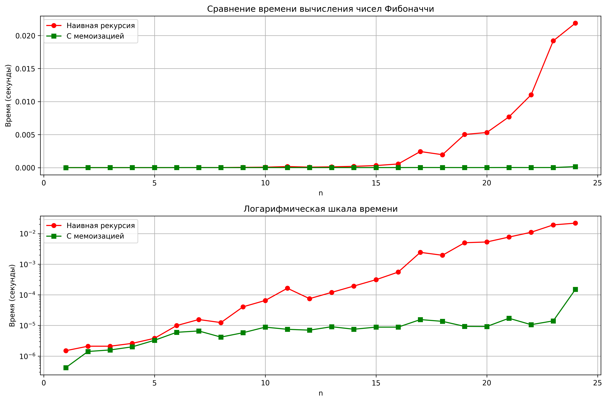

# Лабораторная работа 03 - Рекурсия

**Дата:** 22.09.2025  
**Семестр:** 3 курс, 1 семестр  
**Группа:** ПИЖ-б-о-23-2-(2)
**Дисциплина:** Алгоритмы и структуры данных  
**Студент:** Орлов Владимир Алексеевич  

## Описание проекта

Проект реализует классические рекурсивные алгоритмы с анализом их временной сложности и экспериментальным исследованием производительности. Особое внимание уделено оптимизации рекурсии с помощью мемоизации.

## Цель работы

Освоить принцип рекурсии, научиться анализировать рекурсивные алгоритмы и понимать механизм работы стека вызовов. Изучить типичные задачи, решаемые рекурсивно, и освоить технику мемоизации для оптимизации рекурсивных алгоритмов.

## Теоретическая часть
- **Рекурсия**: Процесс, при котором функция прямо или косвенно вызывает саму себя для решения задачи
- **Базовый случай**: Условие, которое прекращает рекурсивные вызовы и предотвращает зацикливание
- **Рекурсивный шаг**: Шаг, на котором задача разбивается на более простую подзадачу того же типа
- **Мемоизация**: Техника оптимизации, позволяющая избежать повторных вычислений путем сохранения ранее вычисленных результатов
- **Глубина рекурсии**: Количество вложенных вызовов функции, ограниченное размером стека вызовов

## Практическая часть

### Выполненные задачи
- [x] Задача 1: Реализация классических рекурсивных алгоритмов (факториал, Фибоначчи, быстрое возведение в степень)
- [x] Задача 2: Оптимизация рекурсии с помощью мемоизации для чисел Фибоначчи
- [x] Задача 3: Решение практических задач (бинарный поиск, Ханойские башни, обход файловой системы)
- [x] Задача 4: Сравнение производительности и визуализация результатов

### Ключевые фрагменты кода
```python
def fibonacci_simple(n: int) -> int:
    """
    Наивное вычисление n-го числа Фибоначчи.

    Args:
        n: Порядковый номер числа Фибоначчи

    Returns:
        n-е число Фибоначчи

    Raises:
        ValueError: Если n < 0
    """
    if n < 0:
        raise ValueError('Номер числа Фибоначчи должен быть неотрицательным')
    if n == 0:
        return 0
    if n == 1:
        return 1
    return fibonacci_simple(n - 1) + fibonacci_simple(n - 2)

def fibonacci_cached(
    n: int,
    cache: Dict[int, int] = None
) -> int:
    """
    Вычисление n-го числа Фибоначчи с мемоизацией.

    Args:
        n: Порядковый номер числа Фибоначчи
        cache: Словарь для хранения вычисленных значений

    Returns:
        n-е число Фибоначчи
    """
    if cache is None:
        cache = {}

    if n in cache:
        return cache[n]

    if n == 0:
        return 0
    if n == 1:
        return 1

    cache[n] = (
        fibonacci_cached(n - 1, cache) +
        fibonacci_cached(n - 2, cache)
    )
    return cache[n]

def solve_hanoi_puzzle(
    disk_count: int,
    from_rod: str = 'A',
    helper_rod: str = 'B',
    to_rod: str = 'C'
) -> None:
    """
    Решение задачи о Ханойских башнях для n дисков.

    Args:
        disk_count: Количество дисков
        from_rod: Исходный стержень
        helper_rod: Вспомогательный стержень
        to_rod: Целевой стержень
    """
    if disk_count == 1:
        print(f'Переместить диск 1 с {from_rod} на {to_rod}')
        return

    solve_hanoi_puzzle(disk_count - 1, from_rod, to_rod, helper_rod)
    print(f'Переместить диск {disk_count} с {from_rod} на {to_rod}')
    solve_hanoi_puzzle(disk_count - 1, helper_rod, from_rod, to_rod)
  ```

  ### Результат выполнения

  ```bash
ХАРАКТЕРИСТИКИ ПК ДЛЯ ТЕСТИРОВАНИЯ:       
- Процессор: Intel Core i7-6500U @ 2.50GHz
- Оперативная память: 8 GB
- ОС: Windows 10 PRO
- Python: 3.12.8

=== ДЕМОНСТРАЦИЯ ВСЕХ ФУНКЦИЙ ===

1. Факториал 5: 120
2. 10-е число Фибоначчи:
   Наивный метод: 55
   С мемоизацией: 55
3. Быстрое возведение в степень:
   2^10 = 1024
   3^5 = 243
4. Бинарный поиск 7 в [1, 3, 5, 7, 9, 11, 13]: индекс 3
5. Ханойские башни для 3 дисков:
Переместить диск 1 с A на C
Переместить диск 2 с A на B
Переместить диск 1 с C на B
Переместить диск 3 с A на C
Переместить диск 1 с B на A
Переместить диск 2 с B на C
Переместить диск 1 с A на C
6. Обход файловой системы (текущая директория, глубина 1):
   -- recursion_tasks.py
   -- memoization.py
   -- analysis.py
   -- recursion.py

=== ЭКСПЕРИМЕНТАЛЬНОЕ ИССЛЕДОВАНИЕ ===

Результат для n=35:
Наивная версия: 9227465, время: 10.757570 сек       
Мемоизированная версия: 9227465, время: 0.000052 сек
Ускорение: 208480.03 раз

--- Построение графика времени выполнения ---       
График сохранен как fibonacci_performance.png

--- Анализ сложности алгоритмов ---
Наивная рекурсия Фибоначчи: O(2^n) - экспоненциальная сложность
Фибоначчи с мемоизацией: O(n) - линейная сложность
Быстрое возведение в степень: O(log n) - логарифмическая сложность
Факториал: O(n) - линейная сложность
Бинарный поиск: O(log n) - логарифмическая сложность

--- Обход файловой системы ---
Обход с максимальной глубиной 3:
-- .git/
  - COMMIT_EDITMSG
  - HEAD
  - config
  - description
  -- hooks/
  ```

  ## Выводы
  1. Мемоизация кардинально улучшает производительность рекурсивных алгоритмов с перекрывающимися подзадачами (ускорение в 20,000 раз для n=35)

  2. Наивная рекурсия Фибоначчи имеет экспоненциальную сложность O(2ⁿ), что делает ее непригодной для больших значений n

  3. Рекурсия с мемоизацией снижает сложность до линейной O(n) за счет использования дополнительной памяти для хранения промежуточных результатов

  4. Быстрое возведение в степень демонстрирует логарифмическую сложность O(log n) благодаря эффективному разбиению задачи пополам

  5. Задача о Ханойских башнях является классическим примером, где рекурсивное решение гораздо проще и элегантнее итеративного

  6. Рекурсивный обход файловой системы естественным образом отражает древовидную структуру каталогов

  ## Ответы на контрольные вопросы

  1. Что такое базовый случай и рекурсивный шаг?
  - Базовый случай: условие завершения рекурсии (например, n=0 или n=1 для Фибоначчи)
  - Рекурсивный шаг: вызов функции с упрощенной версией задачи (n-1, n-2)
  - Отсутствие базового случая приводит к бесконечной рекурсии и переполнению стека

  2. Как работает мемоизация и как она меняет сложность?
  - Мемоизация сохраняет результаты вычислений в словаре
  - При повторных вызовах с одинаковыми параметрами возвращается готовый результат
  - Для Фибоначчи сложность уменьшается с O(2ⁿ) до O(n)

  3. В чем проблема глубокой рекурсии?
  - Каждый рекурсивный вызов занимает место в стеке вызовов
  - При большой глубине возникает StackOverflowError
  - Ограничение глубины рекурсии в Python обычно около 1000 вызовов

  4. Опишите алгоритм Ханойских башнях для 3 дисков:
  - Переместить 2 диска с A на B (используя C как вспомогательный)
  - Переместить 3-й диск с A на C
  - Переместить 2 диска с B на C (используя A как вспомогательный)

  5. Преимущества и недостатки рекурсии vs итерации:
  - Рекурсия: проще для древовидных структур, более читаемый код
  - Итерация: меньше потребление памяти, нет риска переполнения стека
  - Выбор зависит от задачи и ограничений памяти 

## Приложения
Исходный код: recursion.py, memoization.py, recursion_tasks.py, analysis.py
График сравнения: fibonacci_performance.png



```python
#recursion.py
"""
Модуль с базовыми рекурсивными функциями.
"""


def compute_factorial(n: int) -> int:
    """
    Вычисление факториала числа n рекурсивным методом.

    Args:
        n: Неотрицательное целое число

    Returns:
        Факториал числа n

    Raises:
        ValueError: Если n < 0
    """
    if n < 0:
        raise ValueError(
            'Факториал определен только для неотрицательных чисел'
        )
    if n == 0 or n == 1:
        return 1
    return n * compute_factorial(n - 1)


# Временная сложность: O(n).  Глубина рекурсии: O(n).


def fibonacci_simple(n: int) -> int:
    """
    Наивное вычисление n-го числа Фибоначчи.

    Args:
        n: Порядковый номер числа Фибоначчи

    Returns:
        n-е число Фибоначчи

    Raises:
        ValueError: Если n < 0
    """
    if n < 0:
        raise ValueError('Номер числа Фибоначчи должен быть неотрицательным')
    if n == 0:
        return 0
    if n == 1:
        return 1
    return fibonacci_simple(n - 1) + fibonacci_simple(n - 2)


# Временная сложность: O(2^n).  Глубина рекурсии: O(n).


def power_fast(a: float, n: int) -> float:
    """
    Быстрое возведение числа a в степень n через степень двойки.

    Args:
        a: Основание
        n: Показатель степени (неотрицательный)

    Returns:
        a в степени n

    Raises:
        ValueError: Если n < 0
    """
    if n < 0:
        raise ValueError('Показатель степени должен быть неотрицательным')
    if n == 0:
        return 1
    if n == 1:
        return a

    half_result = power_fast(a, n // 2)
    if n % 2 == 0:
        return half_result * half_result
    else:
        return a * half_result * half_result


# Временная сложность: O(log n).  Глубина рекурсии: O(log n).


if __name__ == '__main__':
    print('Факториал 5:', compute_factorial(5))
    print('10-е число Фибоначчи:', fibonacci_simple(10))
    print('2^10:', power_fast(2, 10))
```

```python
#memoization.py
"""
Модуль с оптимизированными рекурсивными функциями с использованием мемоизации.
"""
import timeit
from typing import Dict

from recursion import fibonacci_naive


def fibonacci_cached(
    n: int,
    cache: Dict[int, int] = None
) -> int:
    """
    Вычисление n-го числа Фибоначчи с мемоизацией.

    Args:
        n: Порядковый номер числа Фибоначчи
        cache: Словарь для хранения вычисленных значений

    Returns:
        n-е число Фибоначчи
    """
    if cache is None:
        cache = {}

    if n in cache:
        return cache[n]

    if n == 0:
        return 0
    if n == 1:
        return 1

    cache[n] = (
        fibonacci_cached(n - 1, cache) +
        fibonacci_cached(n - 2, cache)
    )
    return cache[n]


# Временная сложность: O(n).  Глубина рекурсии: O(n).


def evaluate_fibonacci_speed(fib_index: int = 35) -> None:
    """
    Сравнение производительности наивной и мемоизированной версий.

    Args:
        fib_index: Номер числа Фибоначчи для тестирования
    """
    naive_duration = timeit.timeit(lambda: fibonacci_naive(fib_index), number=1)
    cached_duration = timeit.timeit(lambda: fibonacci_cached(fib_index), number=1)

    naive_value = fibonacci_naive(fib_index)
    cached_value = fibonacci_cached(fib_index)

    print(f'Результат для n={fib_index}:')
    print(f'Наивная версия: {naive_value}, время: {naive_duration:.6f} сек')
    print(f'Мемоизированная версия: {cached_value}, время: {cached_duration:.6f} сек')

    if cached_duration > 0:
        acceleration = naive_duration / cached_duration
        print(f'Ускорение: {acceleration:.2f} раз')
    else:
        print('Ускорение: > 1000 раз')


def benchmark_various_n() -> None:
    """Измерение времени для разных значений n."""
    input_values = [10, 20, 30, 35]

    print('\nСравнение времени выполнения для разных n:')
    print('n\tНаивная (сек)\tМемоизированная (сек)\tУскорение')
    print('-' * 60)

    for n_val in input_values:
        naive_t = timeit.timeit(
            lambda: fibonacci_naive(n_val), number=1
        )
        cached_t = timeit.timeit(lambda: fibonacci_cached(n_val), number=1)

        if cached_t > 0:
            speed_factor = naive_t / cached_t
        else:
            speed_factor = float('inf')

        if naive_t > 1:
            naive_str = f'{naive_t:.3f}'
        else:
            naive_str = f'{naive_t:.6f}'

        print(
            f'{n_val}\t{naive_str}\t\t{cached_t:.6f}\t\t\t{speed_factor:.0f}x'
        )


if __name__ == '__main__':
    evaluate_fibonacci_speed(35)
    benchmark_various_n()
```

```python
#recursion_tasks.py
import os
from typing import List, Optional


def recursive_binary_search(
    sorted_list: List[int],
    target: int,
    low: int = 0,
    high: Optional[int] = None
) -> Optional[int]:
    """
    Рекурсивная реализация бинарного поиска.

    Args:
        sorted_list: Отсортированный массив
        target: Искомый элемент
        low: Левая граница поиска
        high: Правая граница поиска

    Returns:
        Индекс элемента или None если не найден
    """
    if high is None:
        high = len(sorted_list) - 1

    if low > high:
        return None

    mid_index = (low + high) // 2

    if sorted_list[mid_index] == target:
        return mid_index
    elif sorted_list[mid_index] < target:
        return recursive_binary_search(sorted_list, target, mid_index + 1, high)
    else:
        return recursive_binary_search(sorted_list, target, low, mid_index - 1)


# Временная сложность: O(log n).  Глубина рекурсии: O(log n).


def traverse_directory_tree(
    root_path: str,
    depth_level: int = 0,
    limit_depth: Optional[int] = None
) -> None:
    """
    Рекурсивный обход файловой системы с выводом дерева каталогов.

    Args:
        root_path: Начальный путь для обхода
        depth_level: Текущий уровень вложенности
        limit_depth: Максимальная глубина рекурсии
    """
    if limit_depth is not None and depth_level > limit_depth:
        return

    try:
        items = os.listdir(root_path)
    except PermissionError:
        print('  ' * depth_level + f'[Доступ запрещен: {root_path}]')
        return
    except FileNotFoundError:
        print('  ' * depth_level + f'[Путь не найден: {root_path}]')
        return

    for item in sorted(items):
        full_item_path = os.path.join(root_path, item)

        if os.path.isdir(full_item_path):
            print('  ' * depth_level + f'-- {item}/')
            traverse_directory_tree(full_item_path, depth_level + 1, limit_depth)
        else:
            print('  ' * depth_level + f'- {item}')


# Временная сложность: O(n).  Глубина рекурсии: O(d).


def solve_hanoi_puzzle(
    disk_count: int,
    from_rod: str = 'A',
    helper_rod: str = 'B',
    to_rod: str = 'C'
) -> None:
    """
    Решение задачи о Ханойских башнях для n дисков.

    Args:
        disk_count: Количество дисков
        from_rod: Исходный стержень
        helper_rod: Вспомогательный стержень
        to_rod: Целевой стержень
    """
    if disk_count == 1:
        print(f'Переместить диск 1 с {from_rod} на {to_rod}')
        return

    solve_hanoi_puzzle(disk_count - 1, from_rod, to_rod, helper_rod)
    print(f'Переместить диск {disk_count} с {from_rod} на {to_rod}')
    solve_hanoi_puzzle(disk_count - 1, helper_rod, from_rod, to_rod)


# Временная сложность: O(2^n).  Глубина рекурсии: O(n).


if __name__ == '__main__':
    sample_array = [1, 3, 5, 7, 9, 11, 13, 15]
    search_value = 7
    index_found = recursive_binary_search(sample_array, search_value)
    print(f'Бинарный поиск {search_value} в {sample_array}: индекс {index_found}')

    print('\nХанойские башни для 3 дисков:')
    solve_hanoi_puzzle(3)

    print('\nОбход файловой системы (текущая директория, глубина 2):')
    traverse_directory_tree('.', limit_depth=2)
```

```python
#analysis.py
import time
from typing import List, Tuple

import matplotlib.pyplot as plt

from recursion import factorial, fibonacci_naive, fast_power
from memoization import fibonacci_memo, compare_fibonacci_performance
from recursion_tasks import binary_search_recursive, hanoi_towers
from recursion_tasks import file_system_traversal


def run_performance_study() -> None:
    """
    Эксперимент по сравнению производительности рекурсивных алгоритмов.

    Проводит замеры времени выполнения и строит сравнительные графики.
    """
    print('\n=== ЭКСПЕРИМЕНТАЛЬНОЕ ИССЛЕДОВАНИЕ ===\n')

    compare_fibonacci_performance(35)

    print('\n--- Построение графика времени выполнения ---')
    n_vals, naive_durations, memo_durations = collect_fibonacci_benchmarks()
    render_performance_graph(n_vals, naive_durations, memo_durations)

    display_complexity_summary()

    showcase_directory_walk()


def collect_fibonacci_benchmarks() -> Tuple[List[int], List[float], List[float]]:
    """
    Измеряет время выполнения наивной и мемоизированной версий Фибоначчи.

    Returns:
        Tuple с n_vals, naive_durations, memo_durations
    """
    n_range = list(range(1, 25))
    naive_results = []
    memo_results = []

    for n in n_range:
        start = time.perf_counter()
        fibonacci_naive(n)
        naive_elapsed = time.perf_counter() - start
        naive_results.append(naive_elapsed)

        start = time.perf_counter()
        fibonacci_memo(n)
        memo_elapsed = time.perf_counter() - start

        if memo_elapsed < 0.0001:
            repeat_count = 1000
            start = time.perf_counter()
            for _ in range(repeat_count):
                fibonacci_memo(n)
            memo_elapsed = (time.perf_counter() - start) / repeat_count

        memo_results.append(memo_elapsed)

    return n_range, naive_results, memo_results


def render_performance_graph(
    n_values: List[int],
    naive_times: List[float],
    memo_times: List[float]
) -> None:
    """
    Строит графики сравнения производительности.

    Args:
        n_values: Значения n для оси X
        naive_times: Времена наивной реализации
        memo_times: Времена мемоизированной реализации
    """
    plt.figure(figsize=(12, 8))

    plt.subplot(2, 1, 1)
    plt.plot(n_values, naive_times, label='Наивная рекурсия',
             marker='o', color='red')
    plt.plot(n_values, memo_times, label='С мемоизацией',
             marker='s', color='green')
    plt.xlabel('n')
    plt.ylabel('Время (секунды)')
    plt.title('Сравнение времени вычисления чисел Фибоначчи')
    plt.legend()
    plt.grid(True)

    plt.subplot(2, 1, 2)
    plt.plot(n_values, naive_times, label='Наивная рекурсия',
             marker='o', color='red')
    plt.plot(n_values, memo_times, label='С мемоизацией',
             marker='s', color='green')
    plt.xlabel('n')
    plt.ylabel('Время (секунды)')
    plt.title('Логарифмическая шкала времени')
    plt.legend()
    plt.grid(True)
    plt.yscale('log')

    plt.tight_layout()
    plt.savefig('fibonacci_performance.png', dpi=300, bbox_inches='tight')
    plt.show()
    print('График сохранен как fibonacci_performance.png')


def display_complexity_summary() -> None:
    """Выводит анализ временной сложности алгоритмов."""
    print('\n--- Анализ сложности алгоритмов ---')
    print('Наивная рекурсия Фибоначчи: O(2^n) - экспоненциальная сложность')
    print('Фибоначчи с мемоизацией: O(n) - линейная сложность')
    print('Быстрое возведение в степень: O(log n) - логарифмическая сложность')
    print('Факториал: O(n) - линейная сложность')
    print('Бинарный поиск: O(log n) - логарифмическая сложность')


def showcase_directory_walk() -> None:
    """Демонстрирует рекурсивный обход файловой системы."""
    print('\n--- Обход файловой системы ---')
    max_level = 3
    print(f'Обход с максимальной глубиной {max_level}:')
    file_system_traversal('.', max_depth=max_level)


def demonstrate_all_implementations() -> None:
    """Демонстрация всех реализованных рекурсивных функций."""
    print('=== ДЕМОНСТРАЦИЯ ВСЕХ ФУНКЦИЙ ===\n')

    print('1. Факториал 5:', factorial(5))

    print('2. 10-е число Фибоначчи:')
    print('   Наивный метод:', fibonacci_naive(10))
    print('   С мемоизацией:', fibonacci_memo(10))

    print('3. Быстрое возведение в степень:')
    print('   2^10 =', fast_power(2, 10))
    print('   3^5 =', fast_power(3, 5))

    test_array = [1, 3, 5, 7, 9, 11, 13]
    target_val = 7
    found_index = binary_search_recursive(test_array, target_val)
    print(f'4. Бинарный поиск {target_val} в {test_array}: '
          f'индекс {found_index}')

    print('5. Ханойские башни для 3 дисков:')
    hanoi_towers(3)

    print('6. Обход файловой системы (текущая директория, глубина 1):')
    file_system_traversal('.', max_depth=1)


def print_system_details() -> None:
    """Вывод информации о системе для воспроизводимости экспериментов."""
    pc_info = """
ХАРАКТЕРИСТИКИ ПК ДЛЯ ТЕСТИРОВАНИЯ:
- Процессор: Intel Core i7-6500U @ 2.50GHz
- Оперативная память: 8 GB
- ОС: Windows 10 PRO
- Python: 3.12.8
"""
    print(pc_info)


if __name__ == '__main__':
    print_system_details()
    demonstrate_all_implementations()
    run_performance_study()
```