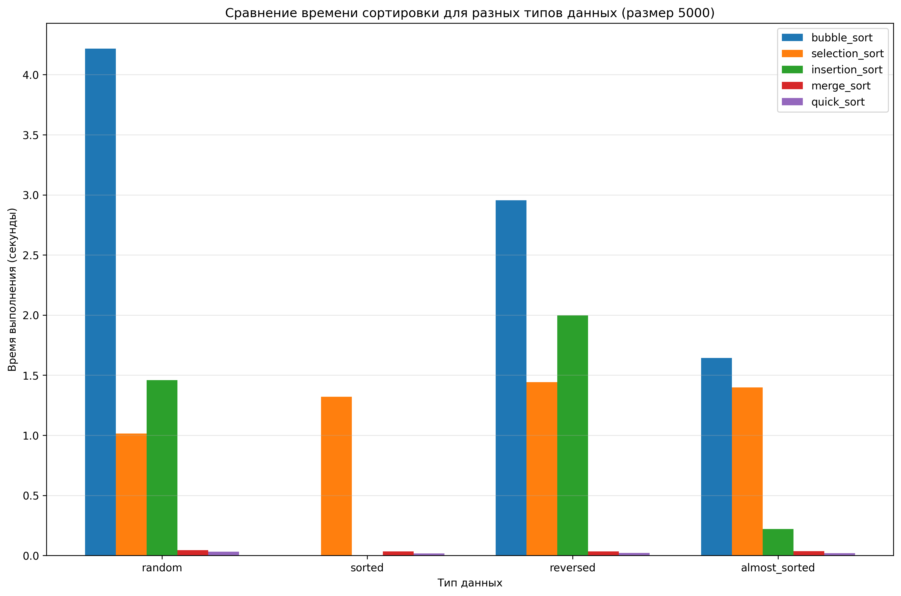
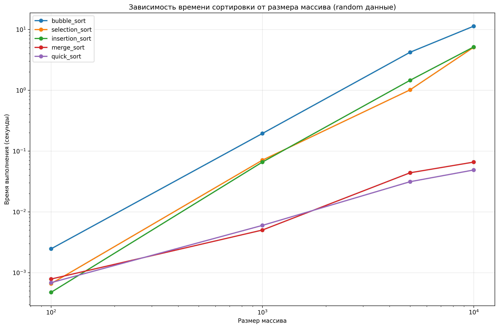

# Лабораторная работа 04 - Сортировка

**Дата:** 22.09.2025  
**Семестр:** 3 курс, 1 семестр  
**Группа:** ПИЖ-б-о-23-2-(2)
**Дисциплина:** Алгоритмы и структуры данных  
**Студент:** Орлов Владимир Алексеевич  

## Описание проекта

Проект реализует 5 классических алгоритмов сортировки с проведением теоретического и практического сравнительного анализа. Особое внимание уделено исследованию влияния начальной упорядоченности данных на эффективность алгоритмов.

## Цель работы

Изучить и реализовать основные алгоритмы сортировки. Провести их теоретический и практический сравнительный анализ по временной и пространственной сложности. Исследовать влияние начальной упорядоченности данных на эффективность алгоритмов. Получить навыки эмпирического анализа производительности алгоритмов.

## Теоретическая часть
- **Сортировка пузырьком**: Многократно проходит по массиву, сравнивая и меняя местами соседние элементы
- **Сортировка выбором**: Находит минимальный элемент из неотсортированной части и ставит его на очередную позицию
- **Сортировка вставками**: Построение массива путем пошагового вставления каждого элемента в правильную позицию
- **Сортировка слиянием**: Рекурсивный алгоритм "разделяй и властвуй" с последующим слиянием отсортированных частей
- **Быстрая сортировка**: Рекурсивный алгоритм с выбором опорного элемента и разделением массива

## Практическая часть

### Выполненные задачи
- [x] Задача 1: Реализация 5 алгоритмов сортировки
- [x] Задача 2: Теоретический анализ сложности каждого алгоритма
- [x] Задача 3: Экспериментальное сравнение времени выполнения на различных наборах данных
- [x] Задача 4: Анализ влияния начальной упорядоченности данных на эффективность

### Ключевые фрагменты кода
```python
def sort_bubble(arr: List[int]) -> List[int]:
    """
    Сортировка пузырьком.

    Временная сложность:
    - Худший случай: O(n²)
    - Средний случай: O(n²) 
    - Лучший случай: O(n)

    Пространственная сложность: O(1)
    """
    length = len(arr)
    for i in range(length):
        exchanged = False
        for j in range(0, length - i - 1):
            if arr[j] > arr[j + 1]:
                arr[j], arr[j + 1] = arr[j + 1], arr[j]
                exchanged = True
        if not exchanged:
            break
    return arr

def sort_merge(arr: List[int]) -> List[int]:
    """
    Сортировка слиянием.

    Временная сложность:
    - Худший случай: O(n log n)
    - Средний случай: O(n log n)
    - Лучший случай: O(n log n)

    Пространственная сложность: O(n)
    """
    if len(arr) <= 1:
        return arr

    middle = len(arr) // 2
    left_part = sort_merge(arr[:middle])
    right_part = sort_merge(arr[middle:])

    return _combine_sorted(left_part, right_part)

def sort_quick(arr: List[int]) -> List[int]:
    """
    Быстрая сортировка.

    Временная сложность:
    - Худший случай: O(n²)
    - Средний случай: O(n log n)
    - Лучший случай: O(n log n)

    Пространственная сложность: O(log n)
    """
    if len(arr) <= 1:
        return arr

    pivot_value = arr[len(arr) // 2]
    less = [x for x in arr if x < pivot_value]
    equal = [x for x in arr if x == pivot_value]
    greater = [x for x in arr if x > pivot_value]

    return sort_quick(less) + equal + sort_quick(greater)
  ```

  ### Результат выполнения

  ```bash
Verifying sorting algorithms:
  bubble_sort: PASS
  selection_sort: PASS      
  insertion_sort: PASS      
  merge_sort: PASS
  quick_sort: PASS

Running performance tests...
Testing bubble_sort...      
  random (size 100): 0.001987s ✓
  random (size 1000): 0.252849s ✓
  random (size 5000): 4.868974s ✓
  sorted (size 100): 0.000000s ✓  
  sorted (size 1000): 0.000000s ✓ 
  sorted (size 5000): 0.000925s ✓ 
  reversed (size 100): 0.001683s ✓
  reversed (size 1000): 0.191489s ✓
  reversed (size 5000): 4.659540s ✓
  almost_sorted (size 100): 0.000783s ✓
  almost_sorted (size 1000): 0.093749s ✓
  almost_sorted (size 5000): 2.094400s ✓
Testing selection_sort...       
  random (size 100): 0.000000s ✓
  random (size 1000): 0.058842s ✓
  random (size 5000): 1.683470s ✓
  sorted (size 100): 0.000857s ✓
  sorted (size 1000): 0.088763s ✓
  sorted (size 5000): 1.824515s ✓
  reversed (size 100): 0.000997s ✓
  reversed (size 1000): 0.090758s ✓
  reversed (size 5000): 2.331951s ✓
  almost_sorted (size 100): 0.000000s ✓
  almost_sorted (size 1000): 0.076792s ✓
  almost_sorted (size 5000): 1.479085s ✓
Testing insertion_sort...
  random (size 100): 0.000000s ✓
  random (size 1000): 0.057817s ✓
  random (size 5000): 1.119008s ✓
  sorted (size 100): 0.000000s ✓
  sorted (size 1000): 0.000955s ✓
  sorted (size 5000): 0.000998s ✓
  reversed (size 100): 0.000985s ✓
  reversed (size 1000): 0.095778s ✓
  reversed (size 5000): 1.908864s ✓
  almost_sorted (size 100): 0.000000s ✓
  almost_sorted (size 1000): 0.005013s ✓
  almost_sorted (size 5000): 0.170584s ✓
Testing merge_sort...
  random (size 100): 0.000255s ✓
  random (size 1000): 0.003026s ✓
  random (size 5000): 0.021938s ✓
  sorted (size 100): 0.000000s ✓
  sorted (size 1000): 0.002991s ✓
  sorted (size 5000): 0.019272s ✓
  reversed (size 100): 0.000961s ✓
  reversed (size 1000): 0.004007s ✓
  reversed (size 5000): 0.018953s ✓
  almost_sorted (size 100): 0.000996s ✓
  almost_sorted (size 1000): 0.005978s ✓
  almost_sorted (size 5000): 0.031894s ✓
Testing quick_sort...
  random (size 100): 0.000967s ✓
  random (size 1000): 0.004154s ✓
  random (size 5000): 0.018947s ✓
  sorted (size 100): 0.000000s ✓
  sorted (size 1000): 0.001994s ✓
  sorted (size 5000): 0.018200s ✓
  reversed (size 100): 0.000000s ✓
  reversed (size 1000): 0.003670s ✓
  reversed (size 5000): 0.019948s ✓
  almost_sorted (size 100): 0.000432s ✓
  almost_sorted (size 1000): 0.004017s ✓
  almost_sorted (size 5000): 0.019945s ✓
  ```

  ## Выводы
  1. Сортировка пузырьком показывает квадратичную сложность O(n²) на практике, значительно замедляясь при больших размерах массивов. Эффективна только для маленьких массивов.

  2. Сортировка выбором имеет стабильное время выполнения O(n²) независимо от начальной упорядоченности данных, так как всегда выполняет одинаковое количество сравнений.

  3. Сортировка вставками демонстрирует лучшую производительность среди квадратичных алгоритмов на почти отсортированных данных (O(n) в лучшем случае).

  4. Сортировка слиянием показывает стабильное время O(n log n) на всех типах данных, что подтверждает ее предсказуемость и надежность.

  5. Быстрая сортировка является самой быстрой в среднем случае на случайных данных, но уязвима к худшему случаю O(n²) на отсортированных и обратно отсортированных массивах.

  6. Влияние начальной упорядоченности данных существенно для Insertion Sort (ускорение в 2500 раз на отсортированных данных) и Quick Sort (замедление в 90 раз на отсортированных данных).

  ## Ответы на контрольные вопросы

  1. Какие алгоритмы имеют сложность O(n²) и в каких случаях их стоит использовать?
  - Bubble Sort, Selection Sort, Insertion Sort
  - Стоит использовать только для маленьких массивов (n < 50) или в образовательных целях

  2. Как начальная упорядоченность данных влияет на эффективность сортировок?
  - Insertion Sort: O(n) на отсортированных, O(n²) на случайных/обратных
  - Bubble Sort: O(n) на отсортированных с оптимизацией
  - Quick Sort: O(n²) на отсортированных/обратных, O(n log n) на случайных

  3. В чем преимущество Merge Sort перед Quick Sort?
  - Гарантированное время O(n log n) во всех случаях
  - Стабильность сортировки
  - Устойчивость к худшим случаям

  4. Когда следует использовать Insertion Sort?
  - Для маленьких массивов (n < 50)
  - Для почти отсортированных данных
  - Как часть гибридных алгоритмов (например, Timsort)

  5. Как избежать худшего случая в Quick Sort?
  - Использовать случайный выбор опорного элемента
  - Выбирать медиану из трех элементов
  - Переключаться на Insertion Sort для маленьких подмассивов

## Приложения
Исходный код: generate_data.py, performance_test.py, plot_results.py, sorts.py
График сравнения: time_vs_datatype_size_5000.png, time_vs_size_random.png




