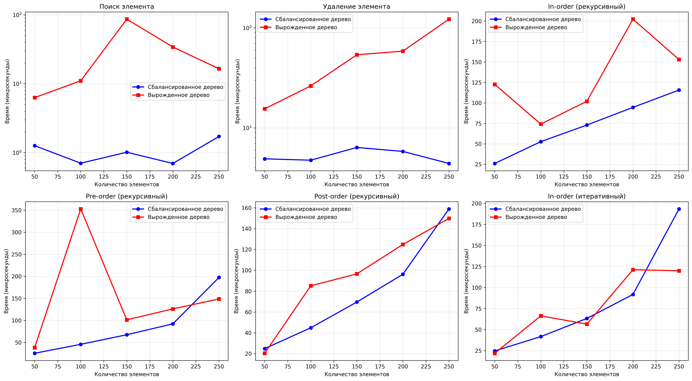

# Лабораторная работа 06 - Деревья

**Дата:** 22.09.2025  
**Семестр:** 3 курс, 1 семестр  
**Группа:** ПИЖ-б-о-23-2-(2)
**Дисциплина:** Алгоритмы и структуры данных  
**Студент:** Орлов Владимир Алексеевич  

## Описание проекта

Проект реализует бинарное дерево поиска (BST) на основе узлов, поддерживает основные операции (вставка, поиск, удаление), различные методы обхода (итеративные и рекурсивные), а также дополнительные методы для анализа дерева. Проведено исследование влияния сбалансированности дерева на производительность операций.

## Цель работы

Изучить древовидные структуры данных, их свойства и применение. Освоить основные операции с бинарными деревьями поиска. Получить практические навыки реализации BST на основе узлов, рекурсивных алгоритмов обхода и анализа их эффективности. Исследовать влияние сбалансированности дерева на производительность операций.

## Теоретическая часть
- **Дерево**: Рекурсивная структура данных, состоящая из узлов, где каждый узел имеет значение и ссылки на дочерние узлы.
- **Бинарное дерево поиска (BST)**: Дерево, для которого выполняются следующие условия:
    1. Значение в левом поддереве любого узла меньше значения в самом узле.
    2. Значение в правом поддереве любого узла больше значения в самом узле.
    3. Оба поддерева являются бинарными деревьями поиска.
- **Вставка (Insert)**: Сложность: в среднем O(log n), в худшем (вырожденное дерево) O(n).
- **Поиск (Search)**: Сложность: в среднем O(log n), в худшем O(n).
- **Удаление (Delete)**: Сложность: в среднем O(log n), в худшем O(n).
- **Сбалансировавнные деревья**: Деревья с контролем высоты (AVL, Красно-Черные), которые гарантируют время операций O(log n) даже в худшем случае.


## Практическая часть

### Выполненные задачи
- [x] Задача 1: Реализация бинарного дерева поиска на основе узлов с основными операциями
- [x] Задача 2: Реализация различных методов обхода дерева (рекурсивные и итеративные)
- [x] Задача 3: Реализация дополнительных методов для работы с BST
- [x] Задача 4: Анализ сложности операций для сбалансированного и вырожденного деревьев
- [x] Задача 5: Визуализация структуры дерева


### Ключевые фрагменты кода
```python
class BSTNode:
    """Узел бинарного дерева поиска."""

    def __init__(self, key: int) -> None:
        """
        Инициализация узла.

        Args:
            key: Значение узла
        """
        self.value: int = key
        self.left: Optional[BSTNode] = None
        self.right: Optional[BSTNode] = None


class SearchBinaryTree:
    """Бинарное дерево поиска."""

    def __init__(self) -> None:
        """Инициализация пустого дерева."""
        self.root: Optional[BSTNode] = None

    def add(self, key: int) -> None:
        """
        Вставка значения в дерево.

        Сложность:
            В среднем: O(log n)
            В худшем случае: O(n) - для вырожденного дерева

        Args:
            key: Значение для вставки
        """
        new_vertex = BSTNode(key)

        if self.root is None:
            self.root = new_vertex
            return

        current = self.root
        while True:
            if key < current.value:
                if current.left is None:
                    current.left = new_vertex
                    return
                current = current.left
            elif key > current.value:
                if current.right is None:
                    current.right = new_vertex
                    return
                current = current.right
            else:
                return

    def contains(self, key: int) -> bool:
        """
        Поиск значения в дереве.

        Сложность:
            В среднем: O(log n)
            В худшем случае: O(n) - для вырожденного дерева

        Args:
            key: Значение для поиска

        Returns:
            True, если значение найдено, иначе False
        """
        current = self.root

        while current is not None:
            if key == current.value:
                return True
            elif key < current.value:
                current = current.left
            else:
                current = current.right

        return Falseы
  ```

  ### Результат выполнения

  ```bash
ХАРАКТЕРИСТИКИ ПК ДЛЯ ТЕСТИРОВАНИЯ:       
- Процессор: Intel Core i7-6500U @ 2.50GHz
- Оперативная память: 8 GB
- ОС: Windows 10 PRO
- Python: 3.12.8

Значения: [50, 30, 70, 20, 40, 60, 80, 10, 25, 35, 45]
Минимальное значение: 10
Максимальное значение: 80
Высота дерева: 4
Корректное BST: True

Скобочное представление:
(50(30(20(10)(25))(40(35)(45)))(70(60)(80)))

Структура дерева:
       50
      ╻━┻━╻
   30       70
  ╻━┻━╻    ╻━┻━╻
 20   40   60   80
╻━┻━╻╻━┻━╻
10 25 35 45

Результаты обходов:
In-order: [10, 20, 25, 30, 35, 40, 45, 50, 60, 70, 80] 
Pre-order: [50, 30, 20, 10, 25, 40, 35, 45, 70, 60, 80]Post-order: [10, 25, 20, 35, 45, 40, 30, 60, 80, 70, 50]
In-order (итеративный): [10, 20, 25, 30, 35, 40, 45, 50, 60, 70, 80]

Поиск элементов:
Поиск 25: найден
Поиск 55: не найден
Поиск 70: найден
Поиск 100: не найден

Удаление элемента:
Удаляемый элемент 25
Минимальное значение: 10
Максимальное значение: 80
Высота дерева: 4
Корректное BST: True

Скобочное представление:
(50(30(20(10)())(40(35)(45)))(70(60)(80)))

Структура дерева:
       50
      ╻━┻━╻
   30       70
  ╻━┻━╻    ╻━┻━╻
 20   40   60   80
╻━╹  ╻━┻━╻
10    35 45
Удаляемый элемент 70
Минимальное значение: 10
Максимальное значение: 80
Высота дерева: 4
Корректное BST: True

Скобочное представление:
(50(30(20(10)())(40(35)(45)))(80(60)()))

Структура дерева:
       50
      ╻━┻━╻
   30       80
  ╻━┻━╻    ╻━╹
 20   40   60
╻━╹  ╻━┻━╻
10    35 45

Демонстрация разных типов деревьев

1. Сбалансированное дерево:
Минимальное значение: 5
Максимальное значение: 70
Высота дерева: 4
Корректное BST: True

Скобочное представление:
(40(20(10(5)(15))(30(25)(35)))(60(50)(70)))

Структура дерева:
       40
      ╻━┻━╻
   20       60
  ╻━┻━╻    ╻━┻━╻
 10   30   50   70
╻━┻━╻╻━┻━╻
 5 15 25 35

2. Вырожденное дерево:
Минимальное значение: 10
Максимальное значение: 70
Высота дерева: 7
Корректное BST: True

Скобочное представление:
(10()(20()(30()(40()(50()(60()(70)))))))

Структура дерева:
10 → 20 → 30 → 40 → 50 → 60 → 70
Вырожденное дерево (правая ветвь)

Анализ производительности
Анализ для размера 50
  Сбалансированное: время=0.000003с, высота=11
  Вырожденное: время=0.000017с, высота=50
Анализ для размера 100
  Сбалансированное: время=0.000007с, высота=13
  Вырожденное: время=0.000012с, высота=100
Анализ для размера 150
  Сбалансированное: время=0.000001с, высота=13
  Вырожденное: время=0.000091с, высота=150
Анализ для размера 200
  Сбалансированное: время=0.000001с, высота=16
  Вырожденное: время=0.000091с, высота=200
Анализ для размера 250
  Сбалансированное: время=0.000001с, высота=15
  Вырожденное: время=0.000044с, высота=250

Выводы:
1. Сбалансированные деревья показывают производительность O(log n) для поиска и удаления
2. Вырожденные деревья деградируют до O(n) для поиска и удаления
3. Все обходы имеют сложность O(n) независимо от структуры дерева
4. Итеративный обход обычно быстрее рекурсивных из-за отсутствия накладных расходов на вызовы функций
  ```

  ## Выводы
  1. Сбалансированное дерево демонстрирует предсказуемую производительность с временем операций, близким к O(log n).

  2. Вырожденное дерево (например, при вставке отсортированных данных) ведёт себя как связный список, что приводит к времени операций O(n).

  3. Итеративный обход in-order с использованием стека показал сравнимую производительность с рекурсивным, но без риска переполнения стека.

  4. Методы find_min и find_max работают за O(h), где h — высота дерева.

  5. Проверка is_valid_bst подтвердила корректность реализации дерева.

  6. Высота дерева существенно влияет на все операции: чем больше высота, тем хуже производительность.

  ## Ответы на контрольные вопросы

  1. Какие основные операции поддерживает BST?
  - Вставка, поиск, удаление, обход (in-order, pre-order, post-order).

  2. Как сбалансированность дерева влияет на производительность?
  - Сбалансированное дерево гарантирует O(log n) время операций, в то время как вырожденное дерево может деградировать до O(n).

  3. В чём преимущество итеративного обхода перед рекурсивным?
  - Итеративный обход не использует стек вызовов функции, что предотвращает риск переполнения стека при больших деревьях.

  4. Какие методы используются для проверки корректности BST?
  - Обход in-order с проверкой возрастания значений или рекурсивная проверка диапазонов значений для каждого узла.

  5. Какие существуют виды сбалансированных деревьев?
  - AVL-деревья, Красно-Черные деревья, B-деревья и другие.

  6. Как можно визуализировать структуру дерева в консоли?
  - Используя рекурсивный вывод с отступами или символьную графику (например, с использованием символов ├──, └──).

## Приложения
Исходный код: binary_search_tree.py, analysis.py, main.py, tree_traversal.py, visualization.py
График сравнения: performance_analysis.png




