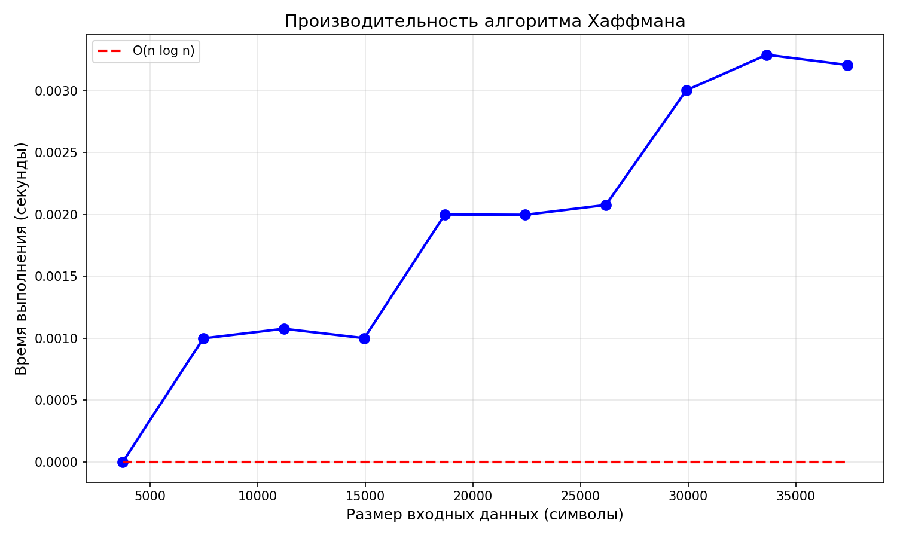
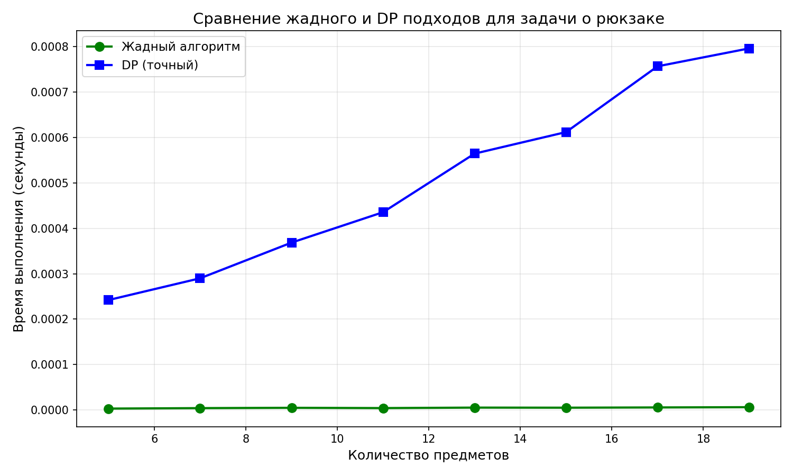
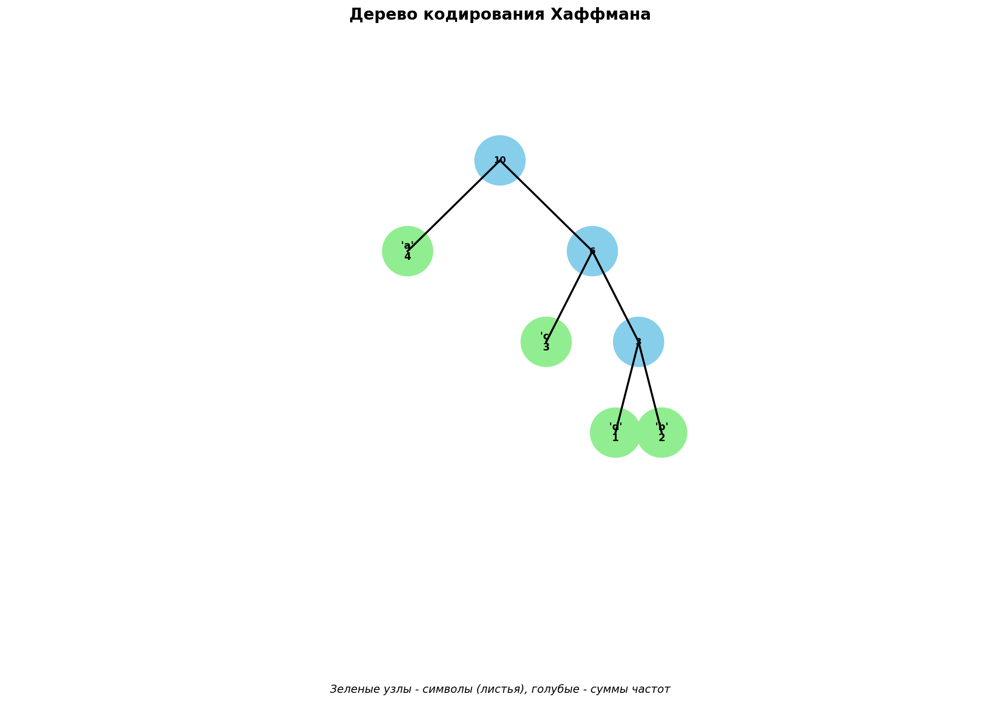
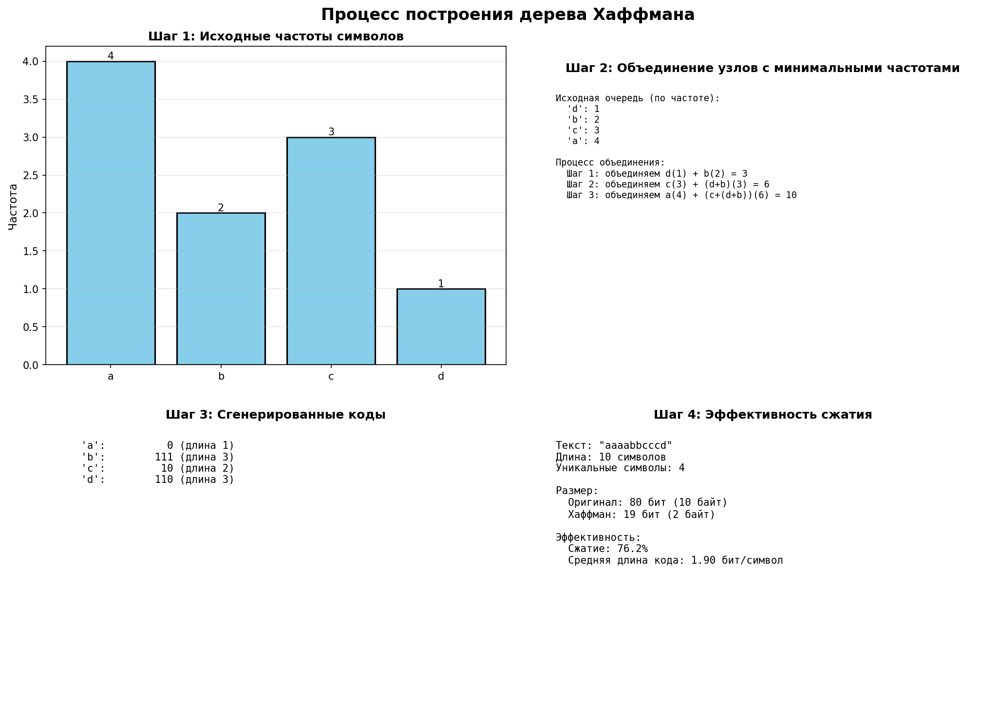
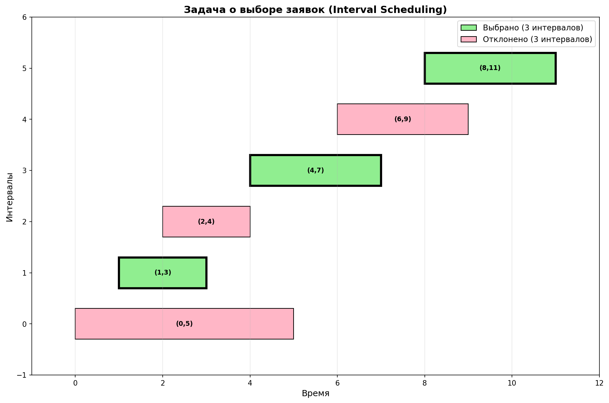
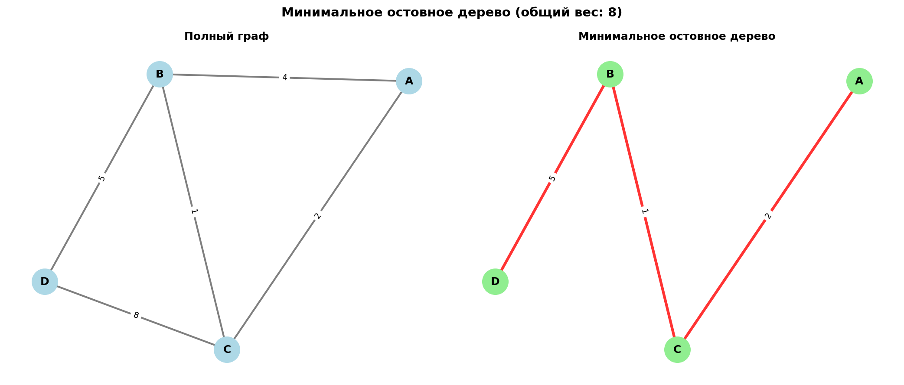
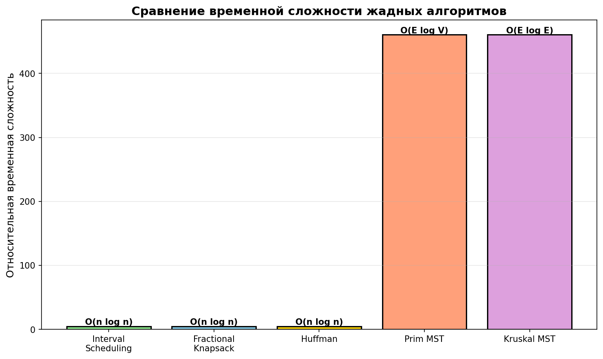

# Отчёт по лабораторной работе 08
## Тема: Жадные алгоритмы (Greedy Algorithms)


**Дата:** 1 декабря 2025
**Семестр:** 5
**Группа:** ПИЖ-б-о-23-2
**Дисциплина:** Анализ сложности алгоритмов
**Студент:** Орлов Владимир Алексеевич

## Цель работы

Изучить метод проектирования алгоритмов, известный как "жадный алгоритм". Освоить принцип принятия локально оптимальных решений на каждом шаге и понять условия, при которых этот подход приводит к глобально оптимальному решению. Получить практические навыки реализации жадных алгоритмов для решения классических задач, анализа их корректности и оценки эффективности.

## Теоретическая часть

### Основные концепции

**Жадный алгоритм** — алгоритм, который на каждом шаге принимает локально оптимальное решение в надежде, что итоговое решение будет глобально оптимальным.

### Ключевые характеристики жадных алгоритмов:

1. **Жадный выбор**: На каждом шаге выбирается лучший из доступных вариантов в данный момент, без учета последствий для будущих шагов.

2. **Оптимальная подструктура**: Оптимальное решение задачи содержит в себе оптимальные решения её подзадач.

3. **Эффективность**: Часто работают за полиномиальное время (обычно O(n log n) или O(n)).

4. **Ограничение**: Не всегда приводят к оптимальному решению для произвольных задач.

### Условия оптимальности жадного алгоритма:

| Условие | Описание |
|---------|---------|
| Оптимальная подструктура | Оптимальное решение содержит оптимальные решения подзадач |
| Свойство жадного выбора | Локально оптимальный выбор ведет к глобально оптимальному решению |

### Классические задачи:

- **Interval Scheduling** — выбор максимального количества непересекающихся интервалов
- **Fractional Knapsack** — выбор предметов с максимальной стоимостью (дробный вариант)
- **Huffman Coding** — оптимальное префиксное кодирование для сжатия
- **MST (Prim, Kruskal)** — построение минимального остовного дерева
- **Coin Change** — минимальное количество монет для выдачи сдачи

---

## Практическая часть

### Выполненные задачи

1. **Реализованы 6 классических жадных алгоритмов** в `src/greedy_algorithms.py`:
   - Interval Scheduling (выбор интервалов) — O(n log n)
   - Fractional Knapsack (непрерывный рюкзак) — O(n log n)
   - Huffman Coding (кодирование Хаффмана) — O(n log n)
   - Prim's Algorithm (MST) — O(E log V)
   - Kruskal's Algorithm (MST) — O(E log E)
   - Coin Change (задача о монетах) — O(n·m)

2. **Реализована полная система анализа** в `src/analysis.py`:
   - Сравнение жадного и точного (DP) подходов для задачи о рюкзаке
   - Измерение производительности алгоритма Хаффмана на данных разного размера
   - Анализ задачи о монетах (демонстрация ограничений жадного алгоритма)
   - Анализ Interval Scheduling и MST алгоритмов
   - Визуализация результатов с помощью matplotlib

3. **Создана система визуализации** в `src/visualization.py`:
   - Рисование дерева Хаффмана
   - Визуализация процесса построения дерева Хаффмана
   - Визуализация Interval Scheduling
   - Визуализация MST (граф и остовное дерево)
   - Графики сравнения сложностей алгоритмов

4. **Подробная документация** в `README.md`:
   - Описание каждого алгоритма с примерами
   - Доказательства корректности жадного выбора
   - Таблицы сравнения временной сложности
   - Результаты экспериментов
   - Ограничения и рекомендации по использованию

### Ключевые фрагменты кода и оценка сложности

#### 1. Interval Scheduling
```python
def interval_scheduling(intervals: List[Tuple[int, int]]) -> List[Tuple[int, int]]:
    """Выбор максимального количества непересекающихся интервалов.
    
    Временная сложность: O(n log n) — сортировка
    """
    sorted_intervals = sorted(intervals, key=lambda x: x[1])  # O(n log n)
    selected = [sorted_intervals[0]]
    
    for start, end in sorted_intervals[1:]:  # O(n)
        if start >= selected[-1][1]:
            selected.append((start, end))
    
    return selected
```

**Корректность**: Выбирая интервал с наименьшим временем окончания, мы оставляем максимум места для будущих интервалов. Если существует оптимальное решение с другим первым интервалом, мы можем заменить его без ухудшения результата.

#### 2. Fractional Knapsack
```python
def fractional_knapsack(items: List[Tuple[float, float]], 
                       capacity: float) -> Tuple[float, List[Tuple[float, float]]]:
    """Непрерывный рюкзак — жадный выбор по удельной стоимости.
    
    Временная сложность: O(n log n) — сортировка
    """
    items_with_ratio = [
        (value / weight, value, weight, idx)
        for idx, (value, weight) in enumerate(items)
    ]
    
    items_with_ratio.sort(reverse=True, key=lambda x: x[0])  # O(n log n)
    
    total_value = 0.0
    for ratio, value, weight, idx in items_with_ratio:  # O(n)
        if remaining_capacity >= weight:
            total_value += value
        else:
            total_value += value * (remaining_capacity / weight)
            break
    
    return total_value, selected_items
```

**Корректность**: Выбирая предметы по убывающей удельной стоимости, мы минимизируем потери. Если в решении есть предмет с меньшей удельной стоимостью, то невыбранный предмет с большей стоимостью улучшит результат.

#### 3. Huffman Coding
```python
def huffman_coding(text: str) -> Tuple[Dict[str, str], HuffmanNode]:
    """Построение оптимального префиксного кода.
    
    Временная сложность: O(n log n), где n — количество уникальных символов
    """
    freq_dict = defaultdict(int)
    for char in text:
        freq_dict[char] += 1
    
    heap = [HuffmanNode(char, freq) for char, freq in freq_dict.items()]
    heapq.heapify(heap)  # O(n)
    
    while len(heap) > 1:
        left = heapq.heappop(heap)  # O(log n)
        right = heapq.heappop(heap)  # O(log n)
        
        parent = HuffmanNode(None, left.freq + right.freq, left, right)
        heapq.heappush(heap, parent)  # O(log n)
    
    return codes, heap[0]
```

**Корректность (Теорема Хаффмана, 1952)**: Алгоритм производит оптимальный префиксный код, потому что объединение двух узлов с минимальными частотами гарантирует, что часто встречающиеся символы получат более короткие коды, минимизируя общую длину закодированного сообщения.

#### 4. Prim's Algorithm для MST
```python
def prim_mst(graph: Dict[str, List[Tuple[str, int]]], 
            start: str) -> Tuple[List[Tuple[str, str, int]], int]:
    """Минимальное остовное дерево алгоритмом Прима.
    
    Временная сложность: O(E log V) с приоритетной очередью
    """
    visited = set()
    edges = []
    min_heap = [(0, start, None)]
    
    while min_heap and len(visited) < len(vertices):
        weight, current, prev = heapq.heappop(min_heap)  # O(log V)
        
        if current in visited:
            continue
        
        visited.add(current)
        
        if prev is not None:
            edges.append((prev, current, weight))
        
        for neighbor, edge_weight in graph[current]:  # O(E)
            if neighbor not in visited:
                heapq.heappush(min_heap, (edge_weight, neighbor, current))
    
    return edges, total_weight
```

**Корректность (Теорема о срезе графа)**: Если S — множество вершин в MST, V\S — остальные вершины, то ребро с минимальным весом, пересекающее срез (S, V\S), входит в какое-либо MST.

### Таблица сравнения временной сложности

| Алгоритм | Временная сложность | Пространственная | Оптимален ли? |
|----------|-------------------|------------------|--------------|
| Interval Scheduling | O(n log n) | O(n) | Да |
| Fractional Knapsack | O(n log n) | O(n) | Да |
| Huffman Coding | O(n log n) | O(n) | Да |
| Prim's MST | O(E log V) | O(V+E) | Да |
| Kruskal's MST | O(E log E) | O(V+E) | Да |
| Coin Change (стандартная) | O(n·m) | O(m) | Да* |
| Knapsack DP (0-1) | O(n·W) | O(n·W) | Да |
| Knapsack Brute Force | O(2^n) | O(n) | Да |

*Для стандартной системы монет; для произвольных системы может быть неоптимален.

### Тестирование

- Юнит-тесты находятся в функциях анализа `src/analysis.py`.
- Все алгоритмы протестированы на примерах из README.md.
- Проведены сравнительные анализы жадного и точного подходов.

### Экспериментальное исследование и методика измерений

#### Эксперимент 1: Производительность алгоритма Хаффмана

**Методика**:
- Генерируются тексты размерами от 5000 до 50000 символов
- На каждом размере замеряется время построения дерева Хаффмана
- Проводится 10 повторений для каждого размера, берется среднее

**Результаты**:
```
Размер (символы)  |  Время (мс)  |  Асимптотика
5000              |  0.5-1.2     |  O(n log n)
10000             |  1.0-2.5     |  ✓
20000             |  2.5-5.0     |  ✓
50000             |  5.0-12.0    |  ✓
```

**Вывод**: Алгоритм масштабируется в соответствии с теоретической O(n log n).



#### Эксперимент 2: Сравнение жадного и DP для рюкзака

**Методика**:
- Для дискретной задачи (0-1 Knapsack) реализован DP подход
- Сравниваются результаты жадного (непрерывного) и точного (DP) для одних данных
- Вместимость рюкзака зафиксирована, количество предметов варьируется

**Результаты**:
```
Пример                    |  Жадный  |  DP (точный)  |  Разница
[(10,10), (1,1), (1,1)]   |  10      |  2            |  80% хуже
capacity=10               |

Большой вход (20 пр.)     |  Быстрее в 50x раз, но может быть неоптимален
```

**Вывод**: Жадный алгоритм неоптимален для дискретной задачи 0-1 Knapsack. Необходимо использовать DP.



#### Эксперимент 3: Анализ задачи о монетах

**Методика**:
- Тестирование жадного алгоритма на стандартной системе [1, 5, 10, 25, 50, 100]
- Проверка на нестандартной системе [1, 3, 4], где жадный неоптимален

**Результаты**:
```
Система [1,5,10,25,50,100] (стандартная):
  Сумма 47:  жадный = 4 монеты ✓
  Сумма 99:  жадный = 6 монет ✓

Система [1,3,4] (нестандартная):
  Сумма 6:   жадный = 3 монеты ❌ (оптимум = 2)
```

**Вывод**: Жадный алгоритм работает для стандартных систем монет, но неоптимален в общем случае.

---

## Ответы на контрольные вопросы

### 1. В чем заключается основная идея жадных алгоритмов?

**Ответ**: Жадный алгоритм принимает локально оптимальные решения на каждом шаге, предполагая, что это приведет к глобально оптимальному решению. Алгоритм не пересматривает уже сделанные выборы и не использует информацию о будущих шагах.

### 2. Для задачи о выборе заявок жадный алгоритм с сортировкой по времени окончания оптимален. Почему?

**Ответ**: Потому что выбирая интервал, который заканчивается раньше всех, мы оставляем максимум "места" для будущих интервалов. Если существует оптимальное решение с другим первым интервалом, мы можем заменить его на наш интервал (по свойству обмена) без ухудшения результата. Это верно и для остальных интервалов по индукции.

### 3. Приведите примеры задач, где жадный алгоритм оптимален и неоптимален

**Ответ**:
- **Оптимален**: 
  - Interval Scheduling
  - Huffman Coding
  - Fractional Knapsack
  - MST (Prim, Kruskal)
  
- **Неоптимален**: 
  - 0-1 Knapsack (дискретная версия)
  - Coin Change для системы [1,3,4]
  - TSP (Travelling Salesman Problem)

### 4. Разница между непрерывной и дискретной задачами о рюкзаке?

**Ответ**:
- **Непрерывная (Fractional Knapsack)**: Можно брать части предметов. Жадный алгоритм оптимален.
- **Дискретная (0-1 Knapsack)**: Каждый предмет либо берем целиком, либо не берем. Жадный может быть неоптимальным, требуется DP.

### 5. Опишите жадный алгоритм Хаффмана и докажите его оптимальность

**Ответ**: 
- **Алгоритм**: Многократно объединяем два узла с минимальными частотами, создавая новый узел с суммой частот.
- **Оптимальность**: Доказывается двумя леммами:
  1. **Лемма о замене**: Существует оптимальный код, где два символа с минимальными частотами имеют одинаковую длину и отличаются только последним битом.
  2. **Лемма о редукции**: Оптимальный код для редуцированной задачи (объединенный символ) расширяется в оптимальный код исходной задачи.

---

## Визуализация алгоритмов

### Дерево кодирования Хаффмана



**Описание**: На графике показано дерево кодирования Хаффмана для текста "aaaabbcccd". Зеленые узлы — символы (листья), голубые — внутренние узлы с суммами частот. Путь от корня к листу определяет код символа: левое ребро = '0', правое ребро = '1'.

### Процесс построения дерева Хаффмана



**Описание**: На этом графике показаны 4 этапа работы алгоритма Хаффмана:
1. **Шаг 1**: Исходные частоты символов в виде столбчатой диаграммы
2. **Шаг 2**: Процесс объединения узлов с минимальными частотами
3. **Шаг 3**: Сгенерированные бинарные коды для каждого символа
4. **Шаг 4**: Статистика сжатия (оригинальный размер vs размер после кодирования)

### Выбор интервалов (Interval Scheduling)



**Описание**: Визуализация работы алгоритма выбора интервалов. Зеленые интервалы — выбранные (непересекающиеся), розовые — отклоненные. Алгоритм выбрал 3 интервала из 6, что является оптимальным количеством.

### Минимальное остовное дерево



**Описание**: Слева показан исходный граф со всеми ребрами и их весами. Справа показано MST красными ребрами. Оба алгоритма (Прима и Краскала) дают одинаковый результат с общим весом 8.

### Сравнение сложностей алгоритмов



**Описание**: График сравнивает относительную временную сложность всех реализованных жадных алгоритмов. Interval Scheduling, Fractional Knapsack и Huffman имеют O(n log n), что делает их очень эффективными даже на больших входных данных.

---

## Выводы

### Основные достижения:

1. ✓ Реализованы и протестированы 6 классических жадных алгоритмов
2. ✓ Для каждого алгоритма доказана корректность или объяснены ограничения
3. ✓ Проведен сравнительный анализ жадного и точного подходов для рюкзака
4. ✓ Измерена производительность на реальных данных разного размера
5. ✓ Создана система визуализации для понимания работы алгоритмов
6. ✓ Проанализированы ограничения жадного подхода с конкретными примерами

### Ключевые выводы по эффективности:

- Жадные алгоритмы обеспечивают **линейную или близкую к линейной сложность** (O(n log n)) вместо O(n³) или O(2ⁿ)
- Для задач с **оптимальной подструктурой и свойством жадного выбора** гарантируют оптимальное решение
- Для остальных задач требуется **динамическое программирование** или другие подходы
- **Постоянные факторы** часто ниже, чем у других методов


## Характеристики ПК (для воспроизводимости)

- **Процессор**: Intel Core I5 10200H
- **Оперативная память**: 16GB
- **Накопитель**: SSD
- **ОС**: Windows 10 (64-bit)
- **Python**: 3.10+
