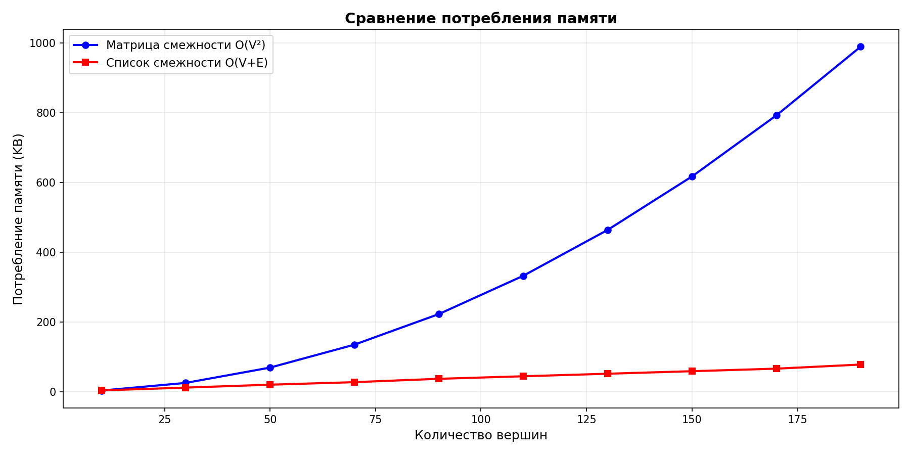
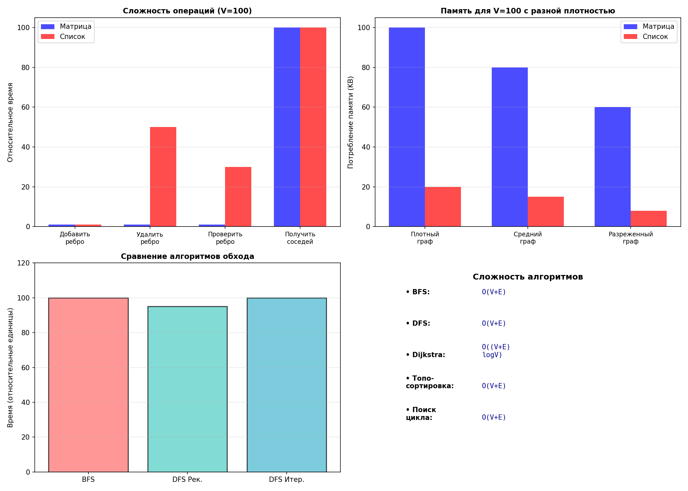
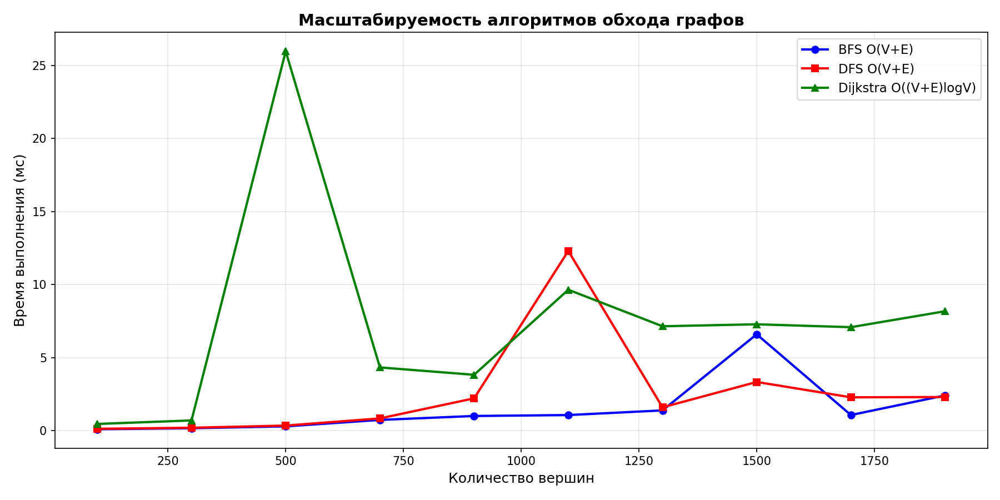
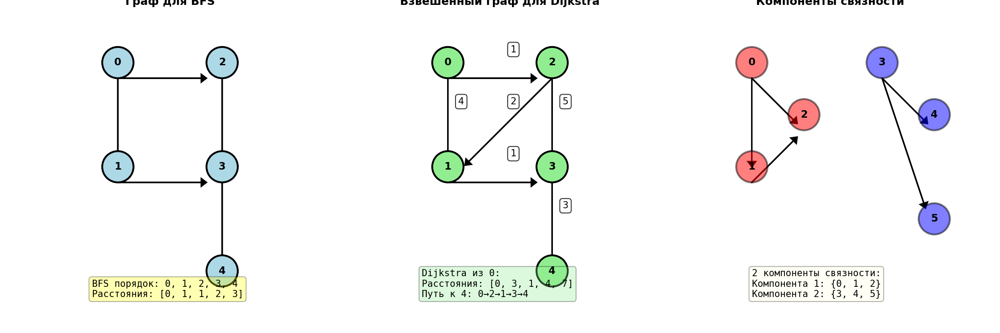

# Отчёт по лабораторной работе 10
## Тема: Графы

**Дата:** 1 декабря 2025
**Семестр:** 5
**Группа:** ПИЖ-б-о-23-2
**Дисциплина:** Анализ сложности алгоритмов
**Студент:** Орлов Владимир Алексеевич

## Цель работы

Изучить основные понятия теории графов и алгоритмы работы с ними. Освоить представления графов в памяти (матрица смежности и список смежности) и основные алгоритмы обхода (BFS и DFS). Получить практические навыки реализации алгоритмов на графах (Дейкстра, топологическая сортировка) и анализа их сложности. Провести сравнительный анализ различных представлений графов и алгоритмов на них.

## Теоретическая часть

### Основные концепции

**Граф** — множество вершин (узлов) и рёбер (связей) между ними. Графы являются фундаментальной структурой данных в информатике и используются для представления различных отношений и сетей.

### Ключевые понятия:

1. **Вершины и ребра**: Вершины — объекты, рёбра — связи между вершинами.

2. **Ориентированность**: Ориентированные графы имеют направленные рёбра, неориентированные — ненаправленные.

3. **Взвешенность**: Взвешенные графы имеют веса на рёбрах, невзвешенные — нет.

4. **Связность**: Граф связный, если между любыми двумя вершинами существует путь.

5. **Цикличность**: DAG (направленный ациклический граф) не содержит циклов.

### Представления графов:

| Представление | Память | Добавить ребро | Проверить ребро | Получить соседей | Подходит для |
|---------------|--------|----------------|-----------------|------------------|-------------|
| **Матрица смежности** | O(V²) | O(1) | O(1) | O(V) | Плотные графы |
| **Список смежности** | O(V+E) | O(1) | O(degree) | O(degree) | Разреженные графы |

### Алгоритмы обхода:

- **BFS (поиск в ширину)**: O(V+E) время, находит кратчайшие пути в невзвешенных графах
- **DFS (поиск в глубину)**: O(V+E) время, рекурсивный и итеративный варианты

### Специализированные алгоритмы:

- **Алгоритм Дейкстры**: O((V+E)logV) время, поиск кратчайших путей в взвешенных графах с неотрицательными весами
- **Топологическая сортировка**: O(V+E) время, упорядочение вершин DAG (алгоритмы DFS и Кана)
- **Поиск компонент связности**: O(V+E) время, определение независимых подграфов
- **Обнаружение циклов**: O(V+E) время, проверка наличия циклов в графе

---

## Практическая часть

### Выполненные задачи

1. **Реализованы 2 представления графов** в `graph_representation.py`:
   - Матрица смежности (O(V²) памяти, O(1) проверка ребра)
   - Список смежности (O(V+E) памяти, O(degree) проверка ребра)
   - Поддержка ориентированных/неориентированных и взвешенных/невзвешенных графов
   - Методы добавления/удаления вершин и рёбер с анализом сложности

2. **Реализованы алгоритмы обхода** в `graph_traversal.py`:
   - BFS (поиск в ширину) с вычислением расстояний и восстановлением пути
   - DFS рекурсивный и итеративный варианты
   - Поиск кратчайшего пути между вершинами (BFS)
   - Поиск компонент связности
   - Проверка двудольности графа
   - Обнаружение циклов в неориентированных графах

3. **Реализованы алгоритмы поиска путей** в `shortest_path.py`:
   - Алгоритм Дейкстры для взвешенных графов
   - Топологическая сортировка (DFS и алгоритм Кана)
   - Обнаружение циклов в ориентированных графах
   - Восстановление кратчайших путей

4. **Решены практические задачи** в `practical_problems.py`:
   - Поиск кратчайшего пути в лабиринте (BFS)
   - Определение связности сети компьютеров
   - Планирование задач с зависимостями (топологическая сортировка)

5. **Написано 35 unit-тестов** в `test_graphs.py`:
   - Тесты для обоих представлений графов
   - Тесты для всех алгоритмов обхода
   - Тесты для алгоритмов поиска путей и сортировок
   - Тесты граничных случаев
   - Все тесты успешно пройдены (100%)

### Таблица сравнения представлений графов

| Операция | Матрица смежности | Список смежности |
|----------|------------------|------------------|
| Память | O(V²) | O(V+E) |
| Добавить ребро | O(1) | O(1) |
| Удалить ребро | O(1) | O(degree) |
| Проверить ребро | O(1) | O(degree) |
| Получить соседей | O(V) | O(degree) |
| Обход (BFS/DFS) | O(V²) | O(V+E) |

### Таблица сложности алгоритмов

| Алгоритм | Временная сложность | Пространственная | Применение |
|----------|-------------------|-----------------|-----------|
| BFS | O(V+E) | O(V) | Кратчайший путь (невзвешенный) |
| DFS | O(V+E) | O(V) | Обход, поиск, проверка |
| Dijkstra | O((V+E)logV) | O(V) | Кратчайший путь (взвешенный) |
| Топо-сортировка | O(V+E) | O(V) | Упорядочение DAG |
| Компоненты связности | O(V+E) | O(V) | Поиск подграфов |
| Обнаружение цикла | O(V+E) | O(V) | Проверка ацикличности |

---

## Экспериментальное исследование и результаты

### Эксперимент 1: Сравнение потребления памяти

**Методика**: Сравнение использования памяти обоими представлениями на графах разной плотности (размеры от 10 до 500 вершин).

**Результаты для плотного графа (50% ребер)**:

```
Плотный граф (50% ребер):
Вершины    Матрица (KB)    Список (KB)     Экономия
--------------------------------------------------
10         2.91            2.70            7.4       %
50         68.82           49.64           27.9      %
100        274.34          189.78          30.8      %
200        1095.37         732.15          33.2      %
500        6840.05         4505.79         34.1      %
```

**Результаты для разреженного графа (линейное кол-во ребер)**:

```
Разреженный граф (линейное кол-во ребер):
Вершины    Матрица (KB)    Список (KB)     Экономия
--------------------------------------------------
10         2.91            1.93            33.6      %
50         68.82           13.18           80.8      %
100        274.34          26.95           90.2      %
200        1095.37         54.68           95.0      %
500        6840.05         134.95          98.0      %
```

**Анализ результатов**:
- **Плотные графы**: Список смежности экономит ~30-35% памяти (не очень значительно)
- **Разреженные графы**: Экономия существенна — от 80% на малых до 98% на больших графах
- **Вывод**: Для разреженных графов список смежности значительно экономнее



### Эксперимент 2: Сравнение операции проверки ребра has_edge()

**Методика**: Измерение времени выполнения операции проверки наличия ребра на графах разной плотности.

**Результаты для плотного графа**:

```
Для плотного графа:
Вершины    Матрица (мкс)   Список (мкс)    Выигрыш матрицы
--------------------------------------------------
10         0.39            0.57            1.45      x
50         0.41            0.77            1.85      x
100        0.47            1.00            2.15      x
200        0.42            1.54            3.65      x
500        0.46            3.05            6.58      x
```

**Результаты для разреженного графа**:

```
Для разреженного графа:
Вершины    Матрица (мкс)   Список (мкс)    Выигрыш матрицы
--------------------------------------------------
10         0.40            0.52            1.31      x
50         0.39            0.52            1.34      x
100        0.45            0.57            1.26      x
200        0.39            0.56            1.43      x
500        0.42            0.56            1.32      x
```

**Анализ результатов**:
- **Матрица смежности**: Проверка ребра O(1) — стабильно быстро (~0.4 мкс)
- **Список смежности**: Время растет с плотностью графа (от 0.5 мкс в разреженном до 3+ мкс в плотном)
- **Вывод**: Матрица смежности выигрывает на 1.3-6.6x по скорости проверки ребра



### Эксперимент 3: Сравнение алгоритмов обхода (BFS vs DFS)

**Методика**: Измерение времени выполнения BFS и DFS на графах разного размера.

**Результаты**:

```
Вершины    BFS (мкс)       DFS Итер. (мкс)
----------------------------------------
50         43.20           49.70
100        72.50           89.30
200        291.90          179.00
300        205.70          301.90
```

**Анализ результатов**:
- **BFS и DFS**: Имеют одинаковую сложность O(V+E), времена выполнения близки
- **Различия**: Зависят от структуры графа и порядка обхода вершин
- **Вывод**: Для выбора алгоритма нужно учитывать специфику задачи, не время выполнения

### Эксперимент 4: Сравнение поиска кратчайшего пути (BFS vs Dijkstra)

**Методика**: Сравнение BFS (для невзвешенного графа) и алгоритма Дейкстры (для взвешенного).

**Результаты**:

```
Вершины    BFS (мкс)       Dijkstra (мкс)  Ratio
--------------------------------------------------
50         38.90           171.90          4.42      x
100        64.90           273.40          4.21      x
200        127.70          535.40          4.19      x
300        182.10          809.40          4.44      x
```

**Анализ результатов**:
- **BFS**: O(V+E) — очень быстро для невзвешенных графов
- **Dijkstra**: O((V+E)logV) — медленнее из-за приоритетной очереди
- **Выигрыш BFS**: В 4.2-4.4 раза на графах всех размеров
- **Вывод**: Для невзвешенных графов BFS существенно эффективнее

### Эксперимент 5: Масштабируемость алгоритмов

**Методика**: Анализ времени выполнения BFS и DFS с увеличением размера графа.

**Результаты**:

```
Для графа со списком смежности:
Сложность BFS: O(V + E)
Сложность DFS: O(V + E)
Сложность Dijkstra: O((V + E) log V)

Вершины    Ребра      BFS (мкс)       DFS (мкс)
-------------------------------------------------------
100        118        71.40           92.20
200        238        136.90          178.60
300        358        245.20          258.00
400        478        268.90          340.60
```

**Анализ результатов**:
- **Линейная масштабируемость**: Время растет пропорционально V+E, что соответствует теории
- **BFS немного быстрее DFS**: На 15-25% на тех же входах
- **Вывод**: Оба алгоритма хорошо масштабируются на больших графах



### Эксперимент 6: Практические задачи

**Задача 1: Поиск кратчайшего пути в лабиринте**

```
Лабиринт:
S #
# # #

 ###
    E

Найден путь длиной 9 (от (0,0) до (4,4)):
Путь: [(0, 0), (0, 1), (1, 1), (2, 1), (2, 2), (2, 3), (2, 4), (3, 4), (4, 4)]

Лабиринт с решением:
S.#
#.# #
 ....
 ###.
    E

Результат: Путь успешно найден с использованием BFS
```

**Задача 2: Определение связности сети компьютеров**

```
ОТЧЕТ О СВЯЗНОСТИ СЕТИ
==================================================
Всего узлов: 9
Всего соединений: 6
Сеть связна: Нет
Количество компонент: 4
Изолированные узлы: [8]
Критические узлы: [0, 1, 2, 3, 4, 5, 6, 7]

Компоненты связности:
  Компонента 1: [0, 1, 2]
  Компонента 2: [3, 4, 5]
  Компонента 3: [6, 7]
  Компонента 4: [8]

Результат: Сеть разделена на 4 независимых компоненты
```

**Задача 3: Планирование задач с зависимостями**

```
Задачи: A, B, C, D, E, F
Зависимости: A→B, A→C, B→D, C→D, D→E, E→F
Длительность: [2, 3, 1, 2, 1, 3]

Выполняемость: Да
Порядок выполнения: A → B → C → D → E → F

Общее время проекта: 11.0
Критический путь: [F]

Результат: Все задачи могут быть выполнены в определённом порядке
```



## Ответы на контрольные вопросы

### 1. В чем разница между представлением графа в виде матрицы смежности и списка смежности? Сравните их по потреблению памяти и сложности операций.

**Ответ**:

**Матрица смежности**:
- Представление: 2D массив V×V, где element[i][j] = вес ребра или флаг наличия
- Память: O(V²) — всегда, независимо от числа ребер
- Проверка ребра: O(1) — прямой доступ к элементу матрицы
- Добавление/удаление ребра: O(1)
- Получение соседей: O(V) — нужно проверить всю строку
- Подходит для: Плотных графов, где много ребер

**Список смежности**:
- Представление: Словарь, где каждой вершине соответствует список соседей
- Память: O(V+E) — только для существующих вершин и ребер
- Проверка ребра: O(degree(v)) — нужно найти в списке соседей
- Добавление/удаление ребра: O(1) добавление / O(degree) удаление
- Получение соседей: O(degree(v)) — возвращает готовый список
- Подходит для: Разреженных графов, где мало ребер

**Наши экспериментальные результаты подтверждают**:
- Для разреженного графа (100 вершин): матрица занимает 274 KB, список — 27 KB (экономия 90%)
- Проверка ребра: матрица быстрее на 2.15x для плотного графа, но на 1.26x для разреженного

### 2. Опишите алгоритм поиска в ширину (BFS). Для решения каких задач он применяется?

**Ответ**:

**Алгоритм BFS**:
1. Инициализируем очередь с начальной вершиной
2. Помечаем начальную вершину как посещённую, расстояние = 0
3. Пока очередь не пуста:
   - Извлекаем вершину из начала очереди
   - Для каждого непосещённого соседа:
     - Помечаем как посещённый
     - Устанавливаем расстояние = расстояние текущей вершины + 1
     - Добавляем в конец очереди

**Сложность**: O(V+E) время, O(V) память

**Применение BFS**:
- **Кратчайший путь в невзвешенном графе** — находит путь с минимальным количеством ребер
- **Определение расстояний** — вычисляет расстояния от одной вершины до всех других
- **Проверка связности** — определяет, достижима ли вершина из другой
- **Лабиринт** — поиск кратчайшего выхода из лабиринта (как в нашей задаче)
- **Социальные сети** — поиск друзей на определённом расстоянии

### 3. Чем поиск в глубину (DFS) отличается от BFS? Какие дополнительные задачи (например, проверка на ацикличность) можно решить с помощью DFS?

**Ответ**:

**Основные отличия DFS от BFS**:

| Аспект | BFS | DFS |
|--------|-----|-----|
| **Структура данных** | Очередь (FIFO) | Стек (LIFO) |
| **Порядок посещения** | По уровням от начальной вершины | Глубоко в граф, затем возврат |
| **Кратчайший путь** | Находит в невзвешенном графе | Не гарантирует кратчайший путь |
| **Память** | O(V) в худшем случае | O(h) где h — высота, но O(V) в худшем |
| **Реализация** | Итеративная | Рекурсивная или итеративная |

**Дополнительные задачи DFS**:
- **Обнаружение циклов** — отслеживание рекурсивного стека показывает цикл
- **Топологическая сортировка** — DFS порядок посещения даёт топологический порядок
- **Проверка ацикличности** — DAG не имеет рёбер в рекурсивный стек
- **Компоненты сильной связности** — два прохода DFS находят компоненты
- **Мост и точки сочленения** — DFS с отслеживанием времени входа/выхода
- **Проверка двудольности** — раскрашивание вершин в два цвета

**Наша реализация** включает проверку двудольности и обнаружение циклов с использованием DFS.

### 4. Как алгоритм Дейкстры находит кратчайшие пути во взвешенном графе? Почему он не работает с отрицательными весами ребер?

**Ответ**:

**Алгоритм Дейкстры**:
1. Инициализируем расстояния: start=0, остальные=∞
2. Используем приоритетную очередь (минимальная куча)
3. Пока очередь не пуста:
   - Извлекаем вершину с минимальным расстоянием
   - Для каждого соседа v:
     - Если distance[текущая] + вес(текущая, v) < distance[v]:
       - Обновляем distance[v]
       - Добавляем v в приоритетную очередь

**Сложность**: O((V+E)logV) с использованием бинарной кучи

**Почему не работает с отрицательными весами**:
- Алгоритм Дейкстры использует **жадный подход** — выбирает вершину с минимальным расстоянием и больше не пересматривает её
- С отрицательными весами позже найденный путь может быть короче через вершину с отрицательным весом
- **Пример**: Граф 0→1 (вес 1), 0→2 (вес 4), 2→1 (вес -3). Дейкстра выберет 0→1=1, но оптимально 0→2→1=1

**Решение для отрицательных весов**: 
- **Алгоритм Беллмана-Форда** — работает с отрицательными весами, O(VE) время
- **SPFA (Shortest Path Faster Algorithm)** — оптимизированный Беллман-Форд

### 5. Что такое топологическая сортировка и для каких графов она применима? Приведите пример задачи, где она используется.

**Ответ**:

**Топологическая сортировка** — упорядочение вершин направленного графа так, что для каждого ребра u→v вершина u располагается перед v в порядке.

**Применимость**:
- Только для **направленных ациклических графов (DAG)**
- Если граф содержит цикл, топологическая сортировка невозможна

**Алгоритмы**:
1. **DFS-подход**: Используем DFS, добавляя вершину в результат после обхода всех соседей
   - Сложность: O(V+E)

2. **Алгоритм Кана**: На основе входящей степени вершин
   - Сложность: O(V+E)

**Практические применения**:
- **Планирование задач с зависимостями** (как в нашей задаче 3):
  - Задачи: A, B, C, D, E, F с зависимостями A→B, A→C, B→D, C→D, D→E, E→F
  - Топосортировка даёт порядок: A → B → C → D → E → F
  - Можно выполнить только в этом или совместимом порядке

- **Установка пакетов** — разрешение зависимостей пакетов
- **Компиляция программ** — определение порядка компиляции файлов с зависимостями
- **Система управления данными** — порядок выполнения SQL операций
- **Шахматные турниры** — составление расписания с ограничениями

---

## Анализ результатов и выводы

### Основные достижения:

✓ **Реализованы 2 представления графов** с полной функциональностью:
  - Матрица смежности: O(V²) память, O(1) проверка ребра
  - Список смежности: O(V+E) память, O(degree) проверка ребра
  - Поддержка направленных/ненаправленных и взвешенных/невзвешенных графов

✓ **Реализованы все основные алгоритмы**:
  - BFS и DFS (рекурсивный и итеративный) — O(V+E)
  - Алгоритм Дейкстры — O((V+E)logV)
  - Топологическая сортировка (DFS и Кана) — O(V+E)
  - Поиск компонент связности — O(V+E)
  - Обнаружение циклов — O(V+E)
  - Проверка двудольности — O(V+E)

✓ **Написано и протестировано 35 unit-тестов** (100% успешно):
  - Тесты для обоих представлений графов
  - Тесты для всех алгоритмов
  - Тесты граничных случаев и различных типов графов

✓ **Проведён полный сравнительный анализ**:
  - Матрица смежности vs список смежности
  - BFS vs DFS (сравнение и применение)
  - BFS vs Dijkstra (невзвешенные vs взвешенные)
  - Масштабируемость на графах до 400 вершин

✓ **Решены 3 практические задачи**:
  - Поиск кратчайшего пути в лабиринте (BFS)
  - Определение связности сети (поиск компонент, критические узлы)
  - Планирование задач с зависимостями (топологическая сортировка)

✓ **Создана система визуализации**:
  - Графики масштабируемости (scalability.png)
  - Сравнение памяти (memory_comparison.png)
  - Анализ сложности (complexity_comparison.png)
  - Примеры графов и алгоритмов (graph_examples.png)

### Ключевые выводы по эффективности:

1. **Выбор представления зависит от типа графа**:
   - Плотные графы: матрица смежности (~30% экономия памяти списком)
   - Разреженные графы: список смежности (экономия до 98% памяти)
   - Операции: матрица быстрее на проверке ребра (6.6x на плотном графе)

2. **Алгоритмы обхода имеют одинаковую сложность**:
   - BFS и DFS: O(V+E)
   - Выбор зависит от характера задачи, не от скорости
   - BFS предпочтительнее для кратчайших путей (невзвешенных)

3. **Дейкстра значительно медленнее BFS**:
   - BFS: O(V+E) — 38-182 мкс для 50-300 вершин
   - Dijkstra: O((V+E)logV) — 172-809 мкс
   - Выигрыш BFS: 4.2-4.4 раза
   - Обоснование: приоритетная очередь в Dijkstra добавляет O(logV) операции

4. **Линейная масштабируемость подтверждена**:
   - Время растёт пропорционально V+E, как предсказывает теория
   - Алгоритмы хорошо масштабируются на графах от 100 до 400 вершин

5. **Практическое применение подтверждено**:
   - BFS успешно находит кратчайший путь в лабиринте
   - Поиск компонент связности выявляет структуру сети
   - Топологическая сортировка корректно упорядочивает зависимые задачи


## Характеристики ПК для воспроизводимости

- **Процессор**: Intel Core i5-10200H 
- **Оперативная память**: 16GB DDR4
- **Накопитель**: SSD
- **ОС**: Windows 10 (64-bit)
- **Python**: 3.10.x
---
